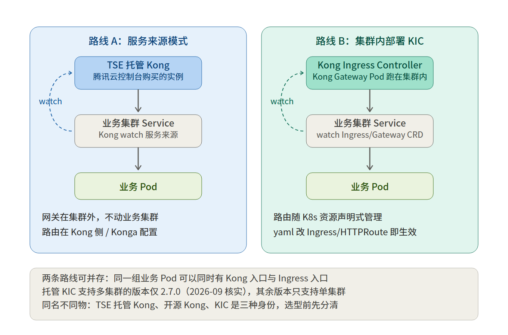
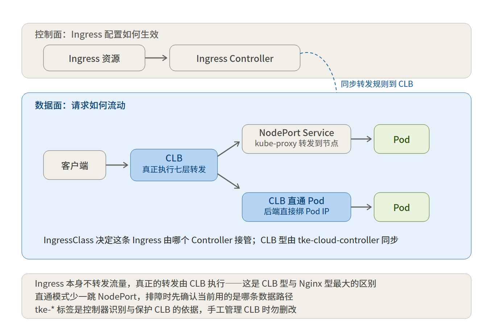

# 腾讯云学习笔记：TKE Ingress 与 Kong 网关

---

## 1. 概念基础：两套体系、两条对接路线

### 1.1 两个界面、两套对象

| 界面 | 属于哪套体系 | 对象 |
|---|---|---|
| TKE 集群「服务与路由」 | Kubernetes 原生对象（集群内部） | Service、Ingress，描述集群内流量怎么转发 |
| Kong 网关「服务路由」 | Kong 自己的配置对象（网关侧） | 路由、服务、服务来源，描述网关收到请求后转给哪个后端 |

两边都叫「服务 / 路由」，但不是同一个东西。这是所有混淆的根源。

### 1.2 集群内：Service 和 Ingress 谁在干活

链路：Ingress 资源 → Ingress Controller → Service → Pod

| 环节 | 是什么 | 作用 |
|---|---|---|
| Ingress 资源 | 一条规则声明：域名 / 路径 → 指向某个 Service | 只声明规则，本身不转发 |
| Ingress Controller | 集群内真正接收流量、按 Ingress 规则转发的进程 | 规则的实际执行者（TKE 里 = CLB 型控制器 / Nginx Ingress / 其他） |
| Service | 一组 Pod 的稳定入口 | 名字和虚拟 IP 恒定，Pod 重建、IP 变化不影响访问；按 SELECTOR 标签认 Pod，把流量分到各副本 |
| Pod | 跑业务容器的副本 | 真正干活，可以被随时杀死重建 |

要点：

- Ingress 是声明，Ingress Controller 才是执行者。没有 controller 读它，Ingress 只是静态配置。
- Service 解决的是「Pod 会死」的问题：访问方只认 Service 的名字，不直接依赖 Pod IP。
- 判断集群实际用了哪种 Ingress，看集群里跑的是哪个 controller：`kubectl get ingressclass`，或 `kubectl get deploy -A | grep -i ingress`。

在集群里把一条链路走一遍（先确认 kubectl 已切到目标集群和命名空间）：

```bash
# 第一步：看 HOSTS / PATH / BACKEND 三列，记下 BACKEND 对应的 Service 名
kubectl get ingress -A -o wide

# 第二步：看 SELECTOR 和 CLUSTER-IP——Service 靠 SELECTOR 认 Pod
kubectl -n <命名空间> get svc <上一步的backend名> -o wide

# 第三步：看到真正跑业务的 Pod 副本
kubectl -n <命名空间> get pods -l <上一步的SELECTOR内容> -o wide
```

### 1.3 Kong 网关内：路由、服务、服务来源

链路：请求 → 路由（入口匹配）→ 服务（后端抽象）→ 服务来源（发现后端）→ 后端实例

| 菜单 | 对应 Kong 对象 | 作用 |
|---|---|---|
| 路由 | Route | 入口匹配规则：host / path / header 满足才放行，不匹配直接 404；决定请求进哪个服务 |
| 服务 | Service | 后端抽象：这个逻辑后端连谁、用什么协议、超时多久、重试几次 |
| 服务来源 | Upstream / 来源插件 | 后端从哪里发现：关联的集群（按命名空间 + Service 名发现）、Nacos、静态 IP |

注意：菜单从上到下是「路由 / 服务 / 服务来源」，不等于请求命中顺序。请求实际是从路由进、经服务、落到服务来源发现的后端——别被菜单顺序误导。

一句话理解三层关系：服务来源告诉网关后端在哪找；服务把一组后端包成一个逻辑后端；路由决定什么请求进这个逻辑后端。三层合起来才是一个完整的转发入口。

### 1.4 同名不同物对照

| 概念 | 集群（K8s） | Kong 网关 |
|---|---|---|
| 入口规则 | Ingress 资源（由 Ingress Controller 执行） | 路由 Route |
| 后端抽象 / 稳定入口 | Service（按标签认 Pod） | 服务 Service（绑定服务来源） |
| 后端发现 | 集群内天然按 SELECTOR 发现 | 服务来源（K8s / Nacos / 静态） |

另一个维度的对象对照（Kong 对象与 K8s 的映射，KIC 模式下）：

| Kong 对象 | 职责 | KIC 中的来源（K8s 映射） |
|---|---|---|
| Route | 入站匹配规则：host、path、header、method、SNI | Ingress（每条 path 一条）或 Gateway API 的 HTTPRoute / GRPCRoute / TCPRoute |
| Service | 上游服务的抽象：协议、host、端口、超时、重试 | Kubernetes Service 自动生成同名 Kong Service |
| Upstream | 负载均衡池 + 健康检查 + 算法（一致性哈希等） | Kubernetes Service 自动对应；细粒度策略用 KongUpstreamPolicy |
| Target | 具体后端实例 IP:Port（含权重） | Endpoints / EndpointSlice 自动同步 |
| Consumer | API 调用方身份，key-auth / JWT / ACL 等插件的挂载主体 | KongConsumer CRD |
| Plugin | 横切能力，可作用于全局 / Service / Route / Consumer | KongPlugin CRD + konghq.com/plugins 注解 |

实用心智模型：K8s 的 Service 在 Kong 里被拆成两半——不变的「Service」和可调优的「Upstream/Target」。灰度权重、健康检查阈值这类东西，在 nginx ingress 里要写 annotation，在 Kong 里是 Upstream 的一等字段。

### 1.5 Kong 对接 Kubernetes 的两条路线（二选一）



**路线 A：服务来源模式。** 控制台「服务来源」关联 TKE 集群 → 建「服务」时选集群里的 Service → 建「路由」配域名路径。配置全部在 Kong 控制台完成，Kong 不读集群里的 Ingress 资源。所以「Kong 的 Ingress 功能空置」不是漏配，是这条路用不到它。

**路线 B：KIC 模式（Kong Ingress Controller）。** 把 Kong 关联为集群的 Ingress Controller，之后在集群里写 Ingress 资源（ingressClassName: kong），Kong watch 到后自动生成对应的路由 / 服务。此时才用到 Kong 的 Ingress 功能，配置源头在集群侧。

现象对照（实际环境的观察）：

| 观察 | 说明 |
|---|---|
| Kong「服务路由」三个菜单都有配置 | 走的是路线 A：Kong 是独立网关，自带配置在管理流量 |
| Kong 的 Ingress 没用到 | 没启用 KIC（路线 B）——两条路线二选一，正常 |
| 集群里 Service / Ingress 都在用 | 集群自己的入口链路（CLB 型或 Nginx Ingress → Service → Pod）在工作，和 Kong 是两套并行的体系 |

由此推出的一个判断：路线 A 下 Kong 不 watch 业务集群的 Ingress，所以「业务集群的 Ingress 由谁执行」要看集群里跑的是哪个 Ingress Controller，而不是 Kong。这两个问题不能混成一个。

### 1.6 看一条记录时按什么顺序

1. 它在请求链路的哪一段：入口规则、后端抽象、还是后端发现？
2. 它由谁创建：手写 YAML、控制台操作、还是控制器自动生成？——来源决定改配置要去哪里改。
3. 流量穿过它之后去了哪：看它的指向字段（Ingress 的 BACKEND、Kong 路由指向的服务），顺着指向继续追。

控制台里每条记录都有指向字段，顺着指向一路点下去，等于在重放请求路径。

---

## 2. TKE Ingress 路线全景

### 2.1 四条路线

| 路线 | 控制器 / 数据面 | 特点 | 适用场景与代价 |
|---|---|---|---|
| 应用型 CLB（`qcloud`） | TKE Ingress Controller（l7-lb-controller）+ 腾讯云 CLB（集群外托管） | 不写 ingress.class 或写 qcloud 即由它接管。一条 Ingress 绑定一个 CLB 实例（一个 IP）。CLB 经 NodePort 转发到 Pod；支持 VPC-CNI 时可直连 Pod | 简单七层路由、对 IP 收敛不敏感的场景。代价：路由一多，CLB 实例数和公网 IP 数线性增长 |
| Nginx Ingress | CLB + 集群内容器化 nginx | CLB 之后多一层 nginx 代理，Annotation 扩展原生 Ingress。多条 Ingress 共用一个 CLB（IP 收敛） | 需要较复杂路由且要收敛 IP。但扩展组件已停更，详见 2.3 |
| 云产品托管 | 专享型 API 网关 / 云原生网关（Kong） | 网关在集群外，直连 TKE 的 Pod，无中间节点。自带认证鉴权、流控、灰度分流、缓存、熔断降级 | 多集群统一接入层、需要 API 治理能力。代价：云产品依赖与实例费，且受白名单与版本限制（见第五部分） |
| Others（自建） | 自己装的 Kong / APISIX / Traefik / Envoy Gateway 等 | TKE 不托管，自行安装对应 Ingress Controller，Ingress 上指定 IngressClass。TKE 官方对此路线不提供 SLA | 需要 Kong 完整插件生态、或想上 Gateway API、或已有自建网关标准。代价：版本升级、CVE 修复、容量规划全部自理 |

多控制器共存：TKE 允许集群内同时存在多个 Ingress Controller，靠 `kubernetes.io/ingress.class` 或 `spec.ingressClassName` 区分归属。这让「老的 CLB Ingress 不动、新业务走自建 Kong」这种渐进迁移成为可能。

### 2.2 官方功能对比表（CLB 型 vs Nginx Ingress）

| 模块 | 功能 | 应用型 CLB | Nginx Ingress Controller |
|---|---|---|---|
| 流量管理 | 支持协议 | http、https | http、https、http2、grpc、tcp、udp |
| | IP 管理 | 一条 Ingress 一个 IP（CLB） | 多条 Ingress 一个 IP，地址收敛 |
| | 特征路由 | host、URL | 更多：header、cookie 等 |
| | 流量行为 | 不支持 | 支持重定向、重写等 |
| | 地域感知负载均衡 | 不支持 | 不支持 |
| 应用访问寻址 | 服务发现 | 单 Kubernetes 集群 | 单 Kubernetes 集群 |
| 安全 | SSL 配置 | 支持 | 支持 |
| | 认证授权 | 不支持 | 支持 |
| 可观测性 | 监控指标 | 支持（需在 CLB 中查看） | 支持（云原生监控） |
| | 调用追踪 | 不支持 | 不支持 |
| 组件运维 | — | 关联 CLB 已托管，集群内仅需运行 TKE Ingress Controller | 需集群内运行 Nginx Ingress Controller（控制面 + 数据面） |

### 2.3 Nginx Ingress 现状：已停更

- 上游社区 `ingress-nginx` 于 2025-11 宣布退役，best-effort 维护持续到 2026-03，之后归档，不再有 release、bugfix 和安全补丁。
- 腾讯云容器服务扩展组件 `NginxIngress` 已停止版本更新和维护，官方说明「核心代码完全遵循开源版本，兼容性不受影响，仍可通过自建方式或 TKE 应用市场继续使用」。公告：https://cloud.tencent.com/document/product/457/108517
- 实际影响：继续用 Nginx Ingress = 自行承担安全补丁责任；后续要用不再走「安装 NginxIngress 扩展组件」这条路。

若短期继续用，三种部署方案对比：

| 方案 | 优点 | 缺点 / 适用 |
|---|---|---|
| Deployment + LB | 最简单，CLB 绑各节点 NodePort，节点增删自动同步 | 多一跳 + SNAT，大并发下有端口耗尽与 conntrack 冲突风险 |
| DaemonSet + HostNetwork + LB | CLB 直绑节点 IP:80/443，性能好 | 需人工维护 CLB 与边缘节点，无法自动扩缩容，官方不推荐 |
| Deployment + LB 直连 Pod | 性能好，无需人工维护 CLB | 推荐方案。要求集群用 VPC-CNI，或 Global Router 且已开启 VPC-CNI（混合模式） |

---

## 3. CLB 类型 Ingress 详解

### 3.1 工作原理



在集群里写 Ingress 资源（域名 / 路径 → Service），TKE 的 l7-lb-controller（位于 kube-system 命名空间）watch 到变化后，自动把规则同步成腾讯云 CLB 的监听器，由 CLB 做七层转发。全程声明式：改 YAML，CLB 跟着变。

```
K8s Ingress YAML → l7-lb-controller watch → 调 CLB API 创建监听器 / 绑定后端 → CLB 收流量 → 后端 Pod
                ↘ 也读 tke-* 标签决定 CLB 生命周期归属
                ↘ 也读 31 个 annotation 决定转发细节
```

| 概念 | 在哪看 | 作用 |
|---|---|---|
| l7-lb-controller | kubectl -n kube-system get deploy l7-lb-controller | TKE 内置的 Ingress Controller，watch Ingress 资源并同步 CLB |
| tke-createdBy-flag=yes | CLB 上打的标签 | 标识 CLB 由 TKE 创建；删除 Ingress 时会连带删除 |
| tke-clusterId=<clusterId> | CLB 上打的标签 | 标识归属集群；销毁时清理 |
| tke-lb-ingress-uuid=<uuid> | CLB 上打的标签 | 标识归属哪个 Ingress；用「已有 CLB」时该值不符会被拒绝 |
| tke-lifecycle-owner=tke\|user | CLB 上打的标签 | tke=删 Ingress 时连带删 CLB；user=删 Ingress 时保留 CLB（v2.4.0+） |
| LoadBalancerResource CRD | kubectl get lbr | TKE 内部同步 Ingress 与 CLB 配置的中间对象，不要手动改 |

重要：CLB 一旦被 Ingress 关联，不要在 CLB 控制台手动改它的监听器 / 后端 / 证书——手动修改会被 TKE 覆盖回 YAML 声明的状态。

### 3.2 概述要点（归属与生命周期）

- Ingress 是七层（HTTP/HTTPS）路由规则的集合，集群里必须有 Ingress Controller 才会生效。
- controller 按标准模式工作：根据 Ingress 当前属性持续同步 CLB 实例配置，最终与声明一致。
- Ingress 归属哪个 controller：
  - 不写 kubernetes.io/ingress.class 和 spec.ingressClassName → TKE 接管
  - 值为 qcloud → TKE 接管
  - 改这两个字段 → controller 会重建 CLB 资源（有释放风险，改动前注意）
- 关闭 TKE Ingress Controller 的两种方法：
  - kube-system 下 l7-lb-controller Deployment 副本数调到 0
  - ConfigMap kube-system/tke-service-controller-config 里 EnableIngressController 设为 false
  - 注意：关闭前先确认集群内没有 TKE 管理的 Ingress，否则 CLB 释放失败
- 删除 Ingress 时 CLB 的处理：
  - 自动创建的 CLB（带 tke-createdBy-flag=yes）→ 删除
  - 使用已有 CLB（无该标签）→ 只删监听器，保留 CLB
  - 想保留自动创建的 CLB → 把 tke-lifecycle-owner 设为 user（v2.4.0+）

### 3.3 基本功能与限制

- 一个 CLB 默认最多 50 条转发规则，超出需联系腾讯云提配额
- 业务容器 CLB 和 CVM 业务 CLB 不能共用
- TKE 管理的 CLB，其监听器 / 转发路径 / 证书 / 后端不要到 CLB 控制台操作
- 用「已有 CLB」只能复用控制台手动建的，不能复用 TKE 自动创建的；已有 CLB 支持多个 Ingress 复用
- Ingress apiVersion 与集群 K8s 版本：extensions/v1beta1、networking.k8s.io/v1beta1 → 仅 TKE ≤ 1.20；networking.k8s.io/v1 → TKE ≥ 1.20
- 控制台创建路径：容器服务控制台 → 集群 → 服务与路由 → Ingress → 新建
- 需要重建 Ingress 的场景：CLB 被误删，或改了必须替换 CLB 的注解（如 subnetId）→ 编辑 YAML → 删除 → 用 YAML 重新创建（去掉 status / managedFields / creationTimestamp / finalizers / generation / resourceVersion / uid）

### 3.4 Annotation 分组全表（31 个）

日常最常翻的部分。Ingress 的非默认能力（超时、灰度、限速、跨域、证书等）大多靠 annotation 打开。「最低版本」指该 annotation 可用的 controller 最低版本。

#### CLB 实例选择（建 Ingress 时定一次）

| Annotation | 用途 | 最低版本 |
|---|---|---|
| kubernetes.io/ingress.class | 指定 ingress 类型；qcloud=CLB（默认就是它） | v1.0.0 |
| kubernetes.io/ingress.existLbId | 复用已有 CLB（在 CLB 控制台手动建好的） | v1.0.0 |
| kubernetes.io/ingress.subnetId | 在指定子网建内网 CLB | v1.0.0 |
| kubernetes.io/ingress.internetChargeType | 公网 LB 计费：TRAFFIC_POSTPAID_BY_HOUR（按流量）/ BANDWIDTH_POSTPAID_BY_HOUR（按带宽） | v1.0.0 |
| kubernetes.io/ingress.internetMaxBandwidthOut | 公网带宽上限，1-2048 Mbps；创建后修改无效 | v1.0.0 |
| kubernetes.io/ingress.extensiveParameters | CLB 创建拓展参数（IP 版本、规格、运营商），json 字符串 | v1.0.0 |
| ingress.cloud.tencent.com/listen-ports | 自定义监听端口（默认 80/443），json 数组 | v2.4.1 |

#### 保护与生命周期

| Annotation | 用途 | 最低版本 |
|---|---|---|
| ingress.cloud.tencent.com/modification-protection | CLB 修改保护（开启后 CLB 控制台 / API 都改不了） | v1.7.3 |
| ingress.cloud.tencent.com/deletion-protection | CLB 删除保护（同时保护 Ingress 也删不掉） | v2.5.3 |
| ingress.cloud.tencent.com/loadbalance-retain | 删 Ingress 时保留自动创建的 CLB | v2.9.0 |
| ingress.cloud.tencent.com/mode | 同步模式 skip：删除资源时不删 CLB（前提：未开启配置保护、不支持复用 / 多 ingress 复用） | v2.10.0 |

#### 安全

| Annotation | 用途 | 最低版本 |
|---|---|---|
| ingress.cloud.tencent.com/pass-to-target | 安全组默认放通（CLB→CVM 流量只过 CLB 上的安全组） | v1.8.3 |
| ingress.cloud.tencent.com/security-groups | 绑定 / 解绑安全组（最多 5 个），逗号分隔 ID | v1.8.3 |

#### 协议与重定向

| Annotation | 用途 | 最低版本 |
|---|---|---|
| kubernetes.io/ingress.rule-mix | 混合协议（同一路径同时支持 HTTP 和 HTTPS） | v1.3.0 |
| kubernetes.io/ingress.rule-mix-both | 混合协议全映射（spec.rules 同时映射到 HTTP+HTTPS）；开启后不能再开 rule-mix / auto-rewrite / rewrite-support | v2.8.0 |
| kubernetes.io/ingress.http-rules | 自定义 HTTP 转发规则 json（配合 rule-mix） | v1.3.0 |
| kubernetes.io/ingress.https-rules | 自定义 HTTPS 转发规则 json（配合 rule-mix） | v1.3.0 |
| ingress.cloud.tencent.com/auto-rewrite | HTTP→HTTPS 自动重定向（必须 80 和 443 都存在） | v1.3.0 |
| ingress.cloud.tencent.com/rewrite-support | 支持手动重定向（配合 http-rules / https-rules） | v1.3.0 |
| ingress.cloud.tencent.com/auto-rewrite-code | 自定义自动重定向码（默认 302） | v2.11.0 |

#### 网络模式

| Annotation | 用途 | 最低版本 |
|---|---|---|
| ingress.cloud.tencent.com/direct-access | 七层直连 Pod 模式（CLB 直绑 Pod，省 SNAT、源 IP 透传） | v1.3.0 |
| ingress.cloud.tencent.com/mix-target-prefer | 双栈混绑时 7 层后端 IP 版本偏好（默认 ipv6） | v2.10.0 |

#### 流量控制（直连模式下生效）

| Annotation | 用途 | 最低版本 |
|---|---|---|
| ingress.cloud.tencent.com/enable-grace-shutdown | 优雅停机：Pod 删除时把 CLB 上该 Pod 权重置 0；v2.2.0 起废弃（默认开启） | v1.5.0 |
| ingress.cloud.tencent.com/enable-grace-shutdown-tkex | 同上 tkex 版（看 endpoint not-ready） | v1.5.0 |
| ingress.cloud.tencent.com/enable-grace-deletion | 优雅删除：先等权重全 0 再删后端 | v2.4.0 |
| ingress.cloud.tencent.com/lb-rs-weight | 自定义后端权重（默认权重 + 有状态服务各 pod 权重），json | v1.6.0 |

#### 证书

| Annotation | 用途 | 最低版本 |
|---|---|---|
| ingress.cloud.tencent.com/certificate | 用注解配置证书（json：hosts 列表 + qcloud_cert_id 列表），不能和 spec.tls 一起用 | v2.8.0 |
| ingress.cloud.tencent.com/tke-service-config | 引用 TkeServiceConfig 高级配置 | v1.3.0 |
| ingress.cloud.tencent.com/tke-service-config-auto | 自动创建 TkeServiceConfig，再手动改 | v1.3.0 |

#### 多 Ingress 复用 CLB

| Annotation | 用途 | 最低版本 |
|---|---|---|
| ingress.cloud.tencent.com/enable-group | 多 Ingress 共享一个 CLB（IP 收敛） | v2.10.0 |

#### 只读

| Annotation | 用途 |
|---|---|
| kubernetes.io/ingress.qcloud-loadbalance-id | 只读，查询当前 Ingress 引用的 CLB ID |

计费类型与带宽只在创建时生效，创建后改 annotation 无效——这是常见的「改了没效果」来源。

### 3.5 其余子页面：按场景再看

| 场景 | 子页面 | 重点内容 |
|---|---|---|
| 建 Ingress 时用 | 使用已有 CLB（45686） | 复用限制：不能复用 TKE 自动建的 CLB；删 Ingress 时不删该 CLB；要手动清理 tke-clusterId 标签。包年包月 / 特殊规格 / 已有证书的 CLB 走这条路 |
| | TkeServiceConfig 配置 CLB（45700） | 同一规格 / 带宽 / 安全组在多个 Ingress 复用，或要更细的 CLB 参数；写 TkeServiceConfig 资源 + tke-service-config annotation 引用；auto 为自动建版本 |
| | 混合 HTTP/HTTPS（45693） | 同一路径同时支持 http 和 https，或手动配重定向；rule-mix / http-rules / https-rules 的关系；rule-mix-both 全映射简化用法 |
| | 证书配置（45738） | HTTPS 必选。四种装法：TKE 控制台上传 / spec.tls 引用 Secret / certificate annotation 配证书 ID / 已有 CLB 证书；证书格式要求 |
| 特定场景按需 | 跨 VPC 绑定（59095） | CLB 和集群在不同 VPC 时使用（较少见） |
| | 重定向（59096） | HTTP→HTTPS、整站跳转、自定义重定向码；auto-rewrite（自动）/ rewrite-support（手动）的关系 |
| | 优雅停机（60065） | 滚动更新 / 缩容 / 删 Pod 不丢流量；必须开 direct-access 直连模式才生效；v2.2.0+ 默认开启 |
| | 双算法证书（115386） | 国密合规场景（金融、政企）；国密 + 国际双算法并行 |
| 已停更 | Nginx 类型 Ingress | 扩展组件已停止更新维护（见 2.3），要用走自建或 TKE 应用市场 |

### 3.6 CLB 侧常见问题排查

**改 annotation 但 CLB 没变化**
- controller 状态：kubectl -n kube-system get deploy l7-lb-controller
- controller 版本：kubectl -n kube-system get cm tke-ingress-controller-config -o jsonpath='{.data.VERSION}'
- 同步中间对象：kubectl get lbr -A（状态应为 Synced / Ready）
- controller 日志：kubectl -n kube-system logs -l app=l7-lb-controller --tail=200

**删 Ingress 时 CLB 被连带删除**
- 预防：annotation ingress.cloud.tencent.com/loadbalance-retain: "true"（v2.9.0+）
- 已删：只能从 CLB 控制台 / 回收站恢复；开了删除保护则无法恢复

**流量 502 / 4xx**
- 排查顺序：l7-lb-controller 日志 → CLB 后端绑定状态（控制台）→ Service 的 Endpoints（kubectl get endpoints）→ Pod readinessProbe
- 配了 direct-access 直连模式但 Pod 还没 Ready → 看 l7-lb-controller 日志里的 ReadinessGate 状态

**单个 Ingress 转发规则超 50 条**
- 多 Ingress 复用 CLB：enable-group: "true"（v2.10.0+）
- 或联系腾讯云提 CLB 配额

**HTTPS 证书不生效**
- 查装法是否冲突：spec.tls 和 certificate annotation 不能并存
- 证书格式：Pem 链是否完整、私钥是否匹配
- 看 controller 日志里的证书校验报错

**direct-access 直连模式不生效**
- 集群需 ≥ 1.12；Pod 需启用 ReadinessGate（默认应开启）
- 看 l7-lb-controller 日志确认直连模式已识别

### 3.7 CLB 侧常用命令

```bash
# controller 状态和版本
kubectl -n kube-system get deploy l7-lb-controller
kubectl -n kube-system get cm tke-ingress-controller-config -o jsonpath='{.data.VERSION}'

# 所有 Ingress（带后端）
kubectl get ingress -A -o wide

# 某个 Ingress 用的 CLB ID（annotation 形式）
kubectl get ingress <name> -n <ns> -o jsonpath='{.metadata.annotations.kubernetes\.io/ingress\.qcloud-loadbalance-id}'

# 同步用的 CRD
kubectl get lbr -A

# controller 日志
kubectl -n kube-system logs -l app=l7-lb-controller --tail=200 -f

# 关闭 TKE Ingress Controller（确认无受管资源后再操作）
kubectl -n kube-system scale deploy l7-lb-controller --replicas=0
# 或改 kube-system/tke-service-controller-config 里 EnableIngressController: false
```

### 3.8 CLB 侧易踩坑清单

1. TKE 管理的 CLB 不要在 CLB 控制台手动改——改动会被覆盖回 YAML 声明
2. LoadBalancerResource CRD 不要手动操作——会导致 Ingress 失效
3. 关闭 TKE Ingress Controller 前先确认没有受管 Ingress——否则 CLB 释放失败，留孤儿
4. 改 subnetId 等需要换 CLB 的 annotation 不会原地换 CLB，必须重建 Ingress
5. 修改保护 / 删除保护开启后，对应操作会被直接拒绝，先关闭再操作
6. 公网 CLB 域名化升级（2023-03-06 起）：新公网 CLB 改用域名访问，VIP 动态变化，控制台不显示 VIP——脚本里访问要用域名，不要写死 IP
7. 包年包月 CLB 只能通过「使用已有 CLB」方式绑给 Ingress（TKE 管理的 CLB 不支持包年包月）
8. CLB 和 CVM 业务不能共用——给 TKE 用专用 CLB
9. 不开直连时走 NodePort：多一跳转发且必然 SNAT，流量集中时容易出现端口耗尽或 conntrack 插入冲突丢包；CLB 绑大量节点 NodePort 还会造成负载不均、健康检查探测包放大

---

## 4. Kong 网关本体

### 4.1 Kong 是什么、三层身份

Kong 的定位是 API 网关，不是单纯的 Ingress Controller。数据面基于 OpenResty（Nginx + Lua），控制面提供 Admin API 与声明式配置。它能在 Ingress 之外额外提供鉴权、限流、熔断、请求转换、可观测等能力，代价是概念更多、运维更重。

三层身份，别混：

- **Kong Gateway**：数据面本体，处理请求。开源版 + 企业版。
- **Kong Ingress Controller（KIC）**：Kubernetes 控制器，watch 集群里的 Ingress / Gateway API / Kong CRD，翻译成 Kong Gateway 的配置。不处理流量。
- **Kong Operator**：Kong 主推的 Kubernetes 原生运行方式，接管 Gateway 的 day-2 运维（零停机配置更新、零停机升级、证书轮换、自动扩缩）。

### 4.2 部署模式：DB-less vs DB-backed

| 模式 | 说明 | 取舍 |
|---|---|---|
| DB-less（声明式） | 无数据库，配置以声明式文件（或 K8s CRD）形式加载进内存 | Kubernetes 场景首选。配置即 Git 里的 YAML，可版本化、可回滚、可 Code Review。KIC 3.x 的 Helm chart 默认 router_flavor: expressions |
| DB-backed | 配置存 PostgreSQL，多节点共享 | 适合 Kong 集群规模大、需要 Admin API 动态改配置的场景。代价是多一个数据库要运维，且配置漂移风险高 |

### 4.3 插件

- 开源插件覆盖：认证（key-auth / JWT / OAuth2 / basic-auth）、安全（CORS / IP 黑白名单 / bot-detection）、流控（rate-limiting / request-termination）、可观测（prometheus / zipkin / opentelemetry / file-log / http-log）、转换（request-transformer / response-transformer / cors）
- 企业版独有：OIDC、高级 RBAC、Workspaces、Dev Portal、Vitals 等
- 注意：插件配置引用 Secret 时，KIC 3.4.15 及之前存在 GO-2026-5010（Secret 引用经 diagnostics 端点泄漏）的 Moderate 级漏洞，需升级到修复版本

### 4.4 开源 KIC 版本支持矩阵

| KIC 版本 | 发布日期 | EOL | 备注 |
|---|---|---|---|
| 3.5.x | 2025-07-04 | 2027-12-18 | 当前主线，支持 Gateway API 1.3 |
| 3.4.x | 2024-12-18 | 2027-12-18 | LTS，K8s 1.29–1.32 官方推荐，支持 Gateway API 1.2 |
| 2.12.x | 2023-09-25 | 2026-09-25 | 本月到期；K8s 1.23–1.28 场景仍在用的话必须排升级 |

其他兼容性要点：

- Kubernetes 1.27 – 1.35 均在 KIC 3.x 支持范围内
- Gateway API 对应：KIC 3.2 → 1.1，3.4 → 1.2，3.5 → 1.3。升级 KIC 前先确认集群里的 Gateway API CRD 版本
- Kong Gateway 3.4.x – 3.12.x 与 KIC 3.x 全系兼容
- KIC 3.0 起 Helm 是唯一官方安装方式
- 升级姿势：Helm 不会自动升级 CRD，每次升级 KIC 必须单独 `kubectl kustomize .../config/crd | kubectl apply -f -`，漏掉这步是常见升级事故来源

### 4.5 Ingress → Gateway API

Ingress API 已 feature-frozen，Gateway API 是官方指定的方向。Kong 是 Gateway API 最早、最完整的实现者之一，同时仍继续支持 Ingress 资源。

Gateway API 三层角色模型：

- GatewayClass —— 基础设施提供方定义控制器类型
- Gateway —— 集群运维定义入口（listener、端口、TLS 证书）
- HTTPRoute / GRPCRoute / TCPRoute —— 应用开发方定义路由逻辑（权重、header 匹配、filter）

相比 Ingress 的核心改进：角色分离 + 标准化字段取代 annotation 泛滥 + 原生权重分流 + 完善 status 字段（排障时能直接看出资源是否被 accept、programmed）。

KIC 3.5 的废弃项映射：

| 已废弃（仍可用，有告警） | 迁移目标 | 说明 |
|---|---|---|
| KongIngress | KongUpstreamPolicy | 路由与服务级配置改用专用 annotation |
| TCPIngress | TCPRoute（Gateway API） | 未来版本将移除 |
| UDPIngress | UDPRoute（Gateway API） | 未来版本将移除 |

迁移工具 ingress2gateway（SIG Network 官方，2026-03 发布 1.0）：支持 30+ 个 ingress-nginx annotation 的翻译，会明确告警无法翻译的配置。工具是迁移助手，不是一键替换，导出的 YAML 必须逐条人工复核（尤其 configuration-snippet 这类任意 nginx 指令，不可翻译）。

```bash
# 安装
go install github.com/kubernetes-sigs/ingress2gateway@v1.0.0

# 按命名空间导出（推荐先小范围试）
ingress2gateway print --namespace my-api --providers=ingress-nginx > gwapi.yaml

# 全集群导出
ingress2gateway print --providers=ingress-nginx --all-namespaces > gwapi.yaml
```

---

## 5. 腾讯云托管 Kong（云原生网关）× TKE

### 5.1 产品定位与前提认识

腾讯云云原生网关（微服务引擎 TSE / 微服务平台 TSF 下的组件）内核基于开源 Kong，兼容 Kong 3.x 等主流版本，定位「流量网关 + 安全网关 + 微服务网关」三合一托管产品。支持自定义插件、多可用区与网关数据备份。

前提认识：托管网关本身在集群外，要管理集群内流量，需要把 TKE 集群「关联」给它，以 KIC 模式工作。TKE 集群自身的三条 Ingress 路线（CLB 型、Nginx、Others）里，KIC 本质上是 Others 路线里由腾讯云托管的实现——关联动作在控制台完成，不需要自己在集群里安装 Controller。

时效信息：这两篇文档当前挂在「云原生智能网关」产品名下，控制台导航仍是 TSF → 云原生网关。产品命名近期有变动，以控制台实际为准。

### 5.2 两种对接方式

**方式一：服务来源关联（= 1.5 的路线 A，控制台手动）**

控制台路径：云原生网关实例 → 服务路由 → 服务来源 → 新建，来源类型选「容器服务」，实例选与网关同 VPC 的 TKE 集群。然后在服务路由 → 服务 → 新建，服务类型选「K8S 服务」，填命名空间和服务名，最后配路由规则（请求方法 / 路径 / Host 至少配一种）。

适用：服务数量少、变更不频繁、不希望网关 watch 集群全部资源。

**方式二：开启托管 Kong Ingress Controller（= 1.5 的路线 B）**

前提条件：
1. 已创建云原生网关实例（文档 1826/134765）
2. 已购买 TKE 标准集群或 TKE Serverless 集群

控制台接入路径：TSF 控制台 → 云原生网关 → 云原生网关 → 实例详情 → 左侧 Ingress → 立即关联容器集群 → 选择集群 → 确定。

关键参数：

| 参数 | 说明 |
|---|---|
| 网络前提 | 网关实例与集群网络连通：同 VPC，或用云联网 CCN / 对等连接打通 |
| Ingress 版本 | 2.7.0 / 2.12.0 / 2.5.0 / 1.3.4（2026-07-23 更新的官方列表） |
| 多集群 | 仅 Ingress 2.7.0 支持关联多容器集群。2.12.0 虽在支持列表内，但官方未给它多集群能力 |
| IngressClass | 默认 kong，可自定义，用来标识网关实例 |

接入后验证：服务路由 → 服务，看是否自动生成对应 Service；进服务详情的「服务信息」页签，看是否有节点信息。

解除关联：实例详情 → 基本信息 → Kong Ingress Controller 卡片 → 解除关联。官方原文影响：解除后 Kong 不再监听容器集群变化，资源变更无法同步到网关实例，通过网关访问容器服务可能出现异常。变更影响面较大，操作前需要评估。

### 5.3 Ingress 资源的两种写法

| 维度 | v1beta1 写法 | v1 写法 |
|---|---|---|
| apiVersion | extensions/v1beta1 | networking.k8s.io/v1 |
| 指定 class | annotation：kubernetes.io/ingress.class: kong | spec 字段：ingressClassName: kong |
| 插件注解 | （示例未涉及） | konghq.com/plugins |
| backend | serviceName / servicePort | service.name / service.port.number |
| pathType | 无 | Prefix |

v1 写法示例（新集群统一用这种）：

```yaml
apiVersion: networking.k8s.io/v1
kind: Ingress
metadata:
  name: demo-v1
  annotations:
    konghq.com/plugins: "httpbin-auth"
spec:
  ingressClassName: kong
  rules:
  - http:
      paths:
      - path: /demo-v1
        pathType: Prefix
        backend:
          service:
            name: nginx
            port:
              number: 80
```

extensions/v1beta1 的 Ingress 在 K8s 1.22+ 已被移除，存量资源需要迁移。

### 5.4 官方文档核实结果（2026-09-04）

| 待确认点 | 核对结果 | 状态 |
|---|---|---|
| KIC 版本落后 | 官方支持列表为 2.7.0 / 2.12.0 / 2.5.0 / 1.3.4，仍是 2.x 主线，落后开源 3.x 的判断维持 | 已确认 |
| 多集群限制 | 官方原文（2026-07-23 更新）仍写「仅 Ingress 2.7.0 支持关联多容器集群」 | 已确认 |
| 新购白名单限制 | 官方文档写「目前云原生网关仅对微服务场景，即作为 Polaris（北极星）服务接入层支持开通白名单新购，其余场景不支持新接入」。两篇接入文档未涉及，需另找实例创建 / 购买指南或提工单确认 | 待查 |

另外 Kong 引擎版本与 KIC 版本是两套体系：引擎版本在创建实例时定（官方 API 参考 2.4.1 / 2.5.1）；Ingress(KIC) 版本在关联集群时体现（2.7.0 / 2.12.0 / 2.5.0 / 1.3.4）。

### 5.5 形态 A（托管网关）vs 形态 B（集群内自建 KIC）

| 维度 | 形态 A · 托管云原生网关 | 形态 B · 集群内自建 KIC |
|---|---|---|
| 运维主体 | 腾讯云托管，免底层运维 | 自己管版本、CVE、容量 |
| 版本可控性 | 跟随云产品节奏（目前 2.x），落后开源主线（3.5.x） | 完全自主，可立即上 3.5.x |
| 网络要求 | 网关与集群同 VPC / CCN / 对等连接；直连 Pod，无中间节点 | 在集群内，网络路径最短 |
| 多集群统一接入 | 天然支持（受版本限制：仅 2.7.0） | 需自行部署多套 + 外部 LB 聚合 |
| CI/CD 集成 | 部分配置在控制台，GitOps 需额外打通 | Ingress/CRD 即 YAML，天然 GitOps |
| 成本 | 网关实例费 | 节点资源 + 人力 |

---

## 6. 选型决策与发布回滚

### 6.1 选型决策顺序

1. 只是简单七层路由、域名不多 → 继续用 CLB Ingress（qcloud）。受腾讯云 SLA 保障，运维成本最低。注意 IP 不收敛的成本拐点。
2. 需要 IP 收敛 + 较复杂路由，且能接受自担安全风险 → 短期可继续用 Nginx Ingress（Deployment + LB 直连 Pod 方案，需 VPC-CNI），但必须排迁移计划。
3. 需要 API 治理（鉴权/限流/灰度/插件），且已是北极星微服务体系 → 走形态 A 托管云原生网关，先提工单确认开通与版本。
4. 需要 Kong 完整能力 + 版本自主 + GitOps → 走形态 B，集群内自建 KIC 3.4 LTS（或 3.5.x），前端挂 CLB。
5. 新建集群 / 新业务 → 直接上 Gateway API + Kong，别再从 Ingress 起步。

### 6.2 发布与回滚方案（以形态 B 自建 KIC 替换 Nginx Ingress 为例，风险等级：中）

**版本号**

- Helm chart：kong/kong，KIC 3.4.x（LTS，EOL 2027-12-18）；若集群已用 Gateway API 1.3 则选 3.5.x
- Kong Gateway 镜像：kong:3.9.x 或更高（3.4.x–3.12.x 与 KIC 3.x 全系兼容），不用 EOL 版本
- Gateway API CRD：与 KIC 版本对应（3.4 → 1.2，3.5 → 1.3），用 Standard Channel
- 前置于 Kong 的 CLB：复用现有 VIP 或新建，创建时一次性确定计费类型与带宽

**灰度策略**

- 按域名灰度（推荐，最可控）：先在 Kong 上发布非核心域名，验证通过后再逐个迁移核心域名。同一时刻两套 ingress 并存，靠 DNS/CLB 转发规则切流
- 按流量比例灰度：核心域名用 Gateway API 的 backendRefs 权重，5% → 20% → 50% → 100% 递进。CLB Ingress 路线不支持权重，只能靠调整后端 RS 权重实现，粒度更粗
- 发布窗口：选业务低峰，每次只切一个域名，切完观察 30 分钟再进入下一个

**发布步骤**

1. 前置检查：确认集群网络模式（是否支持 VPC-CNI 直连 Pod）；确认 Gateway API CRD 已安装且版本匹配
2. 安装 CRD（Helm 不管 CRD）：

```bash
kubectl kustomize https://github.com/Kong/kubernetes-ingress-controller/config/crd?ref=v3.4 \
  | kubectl apply -f -
```

3. Helm 安装 KIC 到独立 namespace（如 kong），ingressController.ingressClass 设为 kong，不要覆盖已有的 nginx / qcloud
4. 先建灰度 Ingress/HTTPRoute，指向与现网相同的后端 Service，用非核心域名验证
5. 逐域名切换，每切一个观察 30 分钟
6. 确认全部流量已迁走，再下线旧控制器

**观测验证**

- Kong 侧：开启 prometheus 插件，重点看 kong_http_requests_total（按 route/service 与 status 分组）、kong_upstream_target_health、延迟分位
- 控制器侧：kubectl -n kong logs deploy/&lt;kic&gt; 看配置同步是否有 translation error / config push failed
- CLB 侧：腾讯云可观测平台看后端健康检查异常数、出带宽、连接数、5xx 状态码
- 业务侧：对比切换前后的错误率、P99 延迟、QPS。Kong 与 nginx 的默认超时、body size 限制不同（如 nginx 的 proxy-body-size、proxy-read-timeout），最容易在这里出差异
- 日志：Kong 的 http-log / file-log 插件接入 CLS，比对请求路径是否与预期一致

**回滚条件与操作**

| 触发条件 | 回滚动作 | 影响范围 |
|---|---|---|
| 切换后 5 分钟内 5xx 比例 > 1%，或 P99 延迟上升 > 50% | 将该域名的 Ingress/HTTPRoute 改回原 IngressClass；或 DNS 回切 | 单域名，秒级 |
| Kong Pod 反复 CrashLoop / 配置同步持续失败 | helm rollback -n kong &lt;release&gt; | 全部走 Kong 的域名 |
| 某插件导致请求被错误拦截（如限流阈值过小） | 删除对应 KongPlugin 或摘掉 konghq.com/plugins 注解 | 该插件作用的 route/service |
| CLB 健康检查批量失败 | 检查 Kong Pod 就绪探针与 CLB 安全组；必要时 CLB 后端切回原 nginx | 全量 |

回滚前置条件：旧控制器在整个灰度期必须保持原样不下线，且 CLB/DNS 的回切路径提前演练过一次。没有演练过的回滚方案不算回滚方案。

---

## 7. 配置片段

### 7.1 Helm 安装 KIC（关键 values）

```yaml
# 仅处理 ingressClassName: kong 的 Ingress，与 qcloud / nginx 共存的关键
cat <<'EOF' > values.yaml
ingressController:
  image:
    tag: "3.4"
  ingressClass: kong
  installCRDs: false        # CRD 必须单独手工管理
image:
  repository: kong
  tag: "3.9"
env:
  database: "off"           # DB-less 声明式，K8s 场景首选
  router_flavor: expressions
proxy:
  type: LoadBalancer        # TKE 上会自动创建 CLB
  http:
    enabled: true
  tls:
    enabled: true
resources:
  requests: { cpu: "1", memory: "2Gi" }
autoscaling:
  enabled: true
  minReplicas: 2
  maxReplicas: 10
EOF

helm repo add kong https://charts.konghq.com
helm repo update
helm install kong kong/kong -n kong --create-namespace -f values.yaml
```

### 7.2 插件：限流 + 密钥鉴权

```yaml
apiVersion: configuration.konghq.com/v1
kind: KongPlugin
metadata:
  name: rate-limit-5rpm
config:
  minute: 5
  policy: local
plugin: rate-limiting
---
apiVersion: configuration.konghq.com/v1
kind: KongPlugin
metadata:
  name: key-auth-check
plugin: key-auth
---
apiVersion: networking.k8s.io/v1
kind: Ingress
metadata:
  name: demo
  annotations:
    konghq.com/plugins: "rate-limit-5rpm,key-auth-check"
spec:
  ingressClassName: kong
  rules:
  - host: demo.example.com
    http:
      paths:
      - path: /
        pathType: Prefix
        backend:
          service:
            name: nginx
            port:
              number: 80
```

### 7.3 Gateway API 写法（推荐新建集群使用）

```yaml
apiVersion: gateway.networking.k8s.io/v1
kind: Gateway
metadata:
  name: prod-gw
  namespace: kong
spec:
  gatewayClassName: kong
  listeners:
  - name: http
    port: 80
    protocol: HTTP
  - name: https
    port: 443
    protocol: HTTPS
    tls:
      certificateRefs:
      - name: prod-tls
---
apiVersion: gateway.networking.k8s.io/v1
kind: HTTPRoute
metadata:
  name: demo
spec:
  parentRefs:
  - name: prod-gw
    namespace: kong
  hostnames: ["demo.example.com"]
  rules:
  - matches:
    - path: { type: PathPrefix, value: / }
    backendRefs:
    - name: nginx
      port: 80
      weight: 90      # 灰度：9:1
    - name: nginx-canary
      port: 80
      weight: 10
```

排障优势：Gateway API 资源带 status.conditions，可以直接看到 Accepted / Programmed / ResolvedRefs 三个状态及原因，比 Ingress 靠猜 annotation 是否生效强得多。

---

## 8. Kong/KIC 侧排查清单

链路排查顺序：客户端 → DNS → CLB → Kong（数据面）→ KIC（控制面同步）→ K8s Service → EndpointSlice → Pod。

1. 请求根本没到 CLB：检查 DNS 解析、CLB 安全组放通 80/443、是否被 ACL/安全组拦截。跨地域走 CEN 的，确认云联网带宽与路由
2. CLB 健康检查失败：Kong Pod 是否 Ready；CLB 到 Pod 的探测端口是否正确；VPC-CNI 直连模式下注意节点安全组
3. 到 Kong 但返回 404（no Route matched）：Ingress 的 ingressClassName 是否等于 KIC 配置的 ingressClass；Host 是否匹配；pathType 是否写对（Prefix vs ImplementationSpecific）
4. 返回 401/403：插件作用范围（全局 / Service / Route / Consumer）是否符合预期；KongConsumer 凭证是否创建
5. 返回 503（no healthy upstream）：EndpointSlice 是否有可用 Target；Upstream 健康检查阈值是否过严；服务刚发布时 Target 还没同步
6. 配置改了不生效：看 KIC 日志是否有 translation error；CRD 是否在升级后忘了单独 apply；是否存在多个控制器抢同一个 Ingress
7. 性能问题：Kong 的资源 requests 是否给够；HPA 是否触发；CLB 走 NodePort 时检查节点 conntrack 表与端口占用
8. 跨网段不通：云原生网关与 TKE 集群需同 VPC，或用 CCN / 对等连接打通；安全组、CFW、网络 ACL 逐层确认

---

## 9. 参考文档

- CLB 类型 Ingress 概述：https://cloud.tencent.com/document/product/457/45685
- Ingress 基本功能：https://cloud.tencent.com/document/product/457/31711
- Ingress Annotation 说明：https://cloud.tencent.com/document/product/457/56112
- 使用已有 CLB：https://cloud.tencent.com/document/product/457/45686
- Ingress Controllers 说明：https://cloud.tencent.com/document/product/457/56844
- Nginx 类型 Ingress 详情：https://cloud.tencent.com/document/product/457/50502
- 在 TKE 上部署 Nginx Ingress（三种方案）：https://tencentcloud.com/document/product/457/38072
- NginxIngress 扩展组件停更公告：https://cloud.tencent.com/document/product/457/108517
- 使用 Kong Ingress Controller：https://cloud.tencent.com/document/product/1826/134869
- 创建云原生网关实例：https://cloud.tencent.com/document/product/1826/134765
- 创建云原生 API 网关实例（API 层）：https://cloud.tencent.com/document/api/1364/96757
- 云原生网关概述：https://cloud.tencent.com/document/product/1364/99229
- 使用云原生网关访问 TKE 服务：https://cloud.tencent.com/document/api/460/83138
- Kong 官方：Ingress 版本（v1beta1 vs v1）：https://docs.konghq.com/kubernetes-ingress-controller/latest/concepts/ingress-versions/
- Kong 官方：KIC 版本支持策略（EOL 表）：https://developer.konghq.com/kubernetes-ingress-controller/support
- Kong 官方：版本兼容矩阵：https://docs.konghq.com/kubernetes-ingress-controller/references/version-compatibility
- Kong 官方：Helm 升级 KIC（CRD 需手工升级）：https://developer.konghq.com/kubernetes-ingress-controller/faq/upgrading-ingress-controller
- K8s 官方：Ingress NGINX 退役公告：https://kubernetes.io/blog/2025/11/11/ingress-nginx-retirement/
- K8s 官方：Ingress2Gateway 1.0：https://kubernetes.io/blog/2026/03/20/ingress2gateway-1-0-release/
