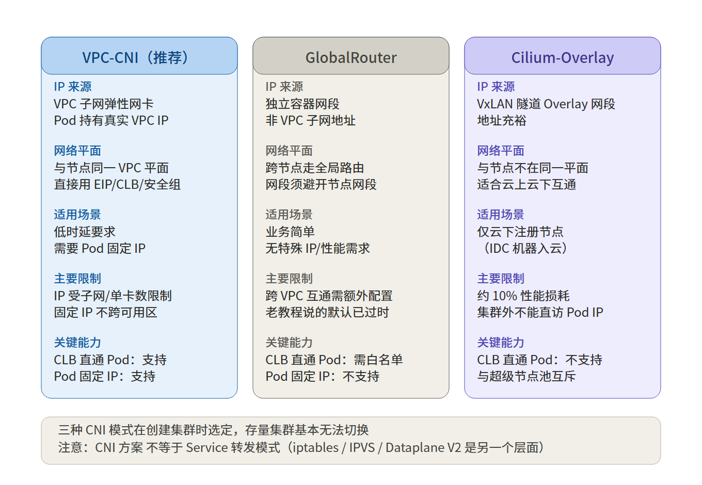
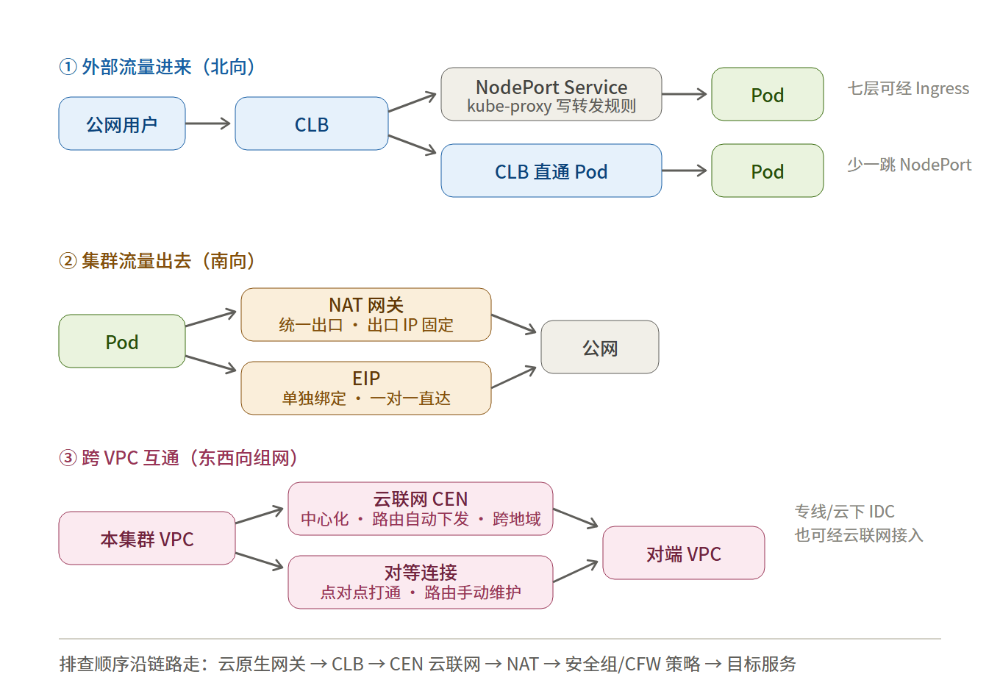

# 腾讯云学习笔记：TKE 集群网络管理

## 1. 概述

集群网络管理覆盖四件事：

1. **Pod 的 IP 从哪来** —— CNI 网络模式（TKE 提供 VPC-CNI、GlobalRouter、Cilium-Overlay 三种，建集群时选定，存量集群基本无法切换）
2. **集群内流量怎么走** —— Service、kube-proxy、CoreDNS
3. **外部流量怎么进来** —— CLB、Ingress、Ingress Controller
4. **集群流量怎么出去** —— NAT 网关、EIP、跨 VPC 互联（云联网 / 对等连接）

文档板块对应关系：CNI 三种模式是第一层；Dataplane V2、IPVS、节点公网 IP 是数据面 / 转发选项——它们和 CNI 模式是两个层面的东西，最容易被误当成网络方案的一种（见 3.2）。

CNI 模式属于"建集群前就要想清楚"的选型问题；Service、DNS、隔离策略、入口绑定方式则是集群运行期可以日常查看和调整的对象。本笔记按"选型 → 运行 → 进出 → 排查"的顺序梳理，第 4 节的命令可在集群内逐条执行验证。

## 2. 核心概念

| 概念 | 含义 |
|---|---|
| CNI（容器网络接口） | 给 Pod 分配 IP、打通 Pod 之间通信的插件化标准 |
| GlobalRouter 模式 | Pod 使用独立于 VPC 子网的容器网段，节点上的 Pod 网段路由下发到 VPC 全局路由实现跨节点互通 |
| VPC-CNI 模式 | 容器与节点在同一网络平面，Pod IP 由 IPAMD 组件（tke-eni-ipamd）从 VPC 弹性网卡（ENI）分配，是 VPC 内真实 IP |
| Cilium-Overlay 模式 | 基于 Cilium VxLAN 隧道的容器网络，容器网络与节点网络不在同一平面；只支持云下注册节点场景 |
| Service | 一组 Pod 的虚拟访问入口，分 ClusterIP / NodePort / LoadBalancer / ExternalName 四类 |
| Endpoints | Service 的真实后端列表，由 selector 匹配出的一组就绪 Pod IP 组成 |
| kube-proxy | 把 Service 转发规则写到各节点的组件，实现方式有 iptables 与 IPVS 两种 |
| Dataplane V2 | TKE 新一代网络数据面，基于 eBPF 实现 Service 转发与 NetworkPolicy，开启后不再安装 kube-proxy |
| CoreDNS | 集群内置 DNS，负责 Service 域名解析，响应所有 Pod 的 DNS 查询 |
| NetworkPolicy | Pod 级网络隔离策略，按选择器与端口定义"谁能访问谁"；需集群网络组件支持才生效 |
| Ingress / IngressClass | Ingress 是七层路由的配置说明，本身不转发流量；IngressClass 标明这条 Ingress 由哪个控制器接管 |
| CLB 直通 Pod | 负载均衡直接把 Pod IP 挂为后端，不经 NodePort 中转 |
| NAT 网关 | 集群访问公网的统一出口（SNAT），出口 IP 固定、带宽共享 |
| CEN 云联网 / 对等连接 | 跨 VPC 互通方案：云联网为中心化组网、路由自动下发、支持跨地域；对等连接为点对点打通、路由手动维护 |
| 安全组 | 实例（节点）级访问控制，状态化：放行入站后响应流量自动放回，无需配回程规则 |

## 3. 关键机制

### 3.1 CNI 三种网络模式：建集群先定，事后基本改不了

官方明确推荐：公有云场景用 VPC-CNI，注册节点（云下 IDC 机器加入集群）场景用 Cilium-Overlay；GlobalRouter 是简单但能力少的老默认方案（老教程说"默认选 GlobalRouter"是过去式）。



三种方案对比（转述官方对比表）：

| 对比项 | VPC-CNI（推荐） | Global Router | Cilium-Overlay |
|---|---|---|---|
| 基本介绍 | Pod 从 VPC 子网地址中划分，建议独占一个子网；能用 VPC 云上能力（EIP/CLB/安全组） | Pod 网段独立于 VPC 子网；跨节点互访走全局路由 | 容器网络与节点网络不在同一平面，基于节点网络的 Overlay |
| 优势 | 不用按节点分 CIDR、IP 不浪费；数据面少一层网桥、性能更高；支持 Pod 固定 IP | 网段独立于 VPC、使用简单、Pod 启动快 | 容器网段独立于 VPC、地址充裕扩展性强；VxLAN 封装适合云上云下互通、兼容性好 |
| 使用场景 | 低时延要求；依赖固定 IP 的传统架构迁移；数据库等需要特殊安全组策略的业务 | 业务简单、对 IP 分配和性能没特殊需求；节点不支持弹性网卡的场景 | 仅注册节点场景 |
| 使用限制 | 与节点同属一个 VPC，IP 资源有限；单节点容器数受弹性网卡及单卡 IP 数限制；固定 IP 不支持跨可用区调度 | 容器与节点网段不可冲突；专线/对等/云联网互通需额外配置；不支持固定 Pod IP | VxLAN 有 10% 以内性能损耗；Pod IP 集群外不能直接访问；需从指定子网取 2 个 IP 建内网负载均衡；不支持固定 Pod IP |
| CLB 直通 Pod | 支持 | 支持（需白名单申请） | 不支持 |
| Pod 固定 IP | 支持 | 不支持 | 不支持 |
| IPv4/IPv6 双栈 | 支持 | 不支持 | 不支持 |
| 指定子网分配 IP | 支持 | 不支持 | 不支持 |
| 扩容 Pod 网段 | 支持 | 支持（暂未产品化） | 不支持 |
| Pod 设置安全组 | 支持 | 不支持 | 不支持 |
| Pod 绑定 EIP | 支持 | 不支持 | 不支持 |
| Pod 访问公网 | NAT、EIP | IP 伪装 | 支持 |

看这张表的判断：能力差距主要在 VPC-CNI 和另外两个之间——固定 IP、双栈、Pod 级安全组、Pod 绑 EIP 都是 VPC-CNI 独占。GlobalRouter 只赢在"简单、网段充裕"。Cilium-Overlay 是为了混合云注册节点专门存在的，纯云上集群不适用。

#### VPC-CNI：把弹性网卡分给 Pod

原理：容器和节点在同一网络平面，容器 IP 是 IPAMD 组件（tke-eni-ipamd）分配的弹性网卡 IP。分两种子模式：

- 共享网卡模式：Pod 共享一张弹性网卡，IPAMD 给网卡申请多个 IP 分给不同 Pod；可固定 Pod IP
- 独占网卡模式：每个 Pod 一张独立弹性网卡，性能更高；但受机型可插网卡数限制，单节点 Pod 密度更低

使用限制：

- 容器子网不建议与其他云上资源共用（云服务器、负载均衡等）
- 节点和容器子网必须在同一可用区，否则 Pod 无法调度
- 单节点可调度的 Pod 数受"弹性网卡数量 × 单卡可绑 IP 数"限制，看节点 Allocatable 确认

相比 GlobalRouter 的应用价值：少一层网桥、转发性能约高 10%；支持固定 IP（传统架构迁移、按 IP 做安全策略）；支持 LB 直通 Pod。集群选 VPC-CNI 后自动安装 tke-eni-ipamd（Deployment）、tke-eni-agent（DaemonSet）等组件；StatefulSet 固定 IP 的 Pod 重启、迁移后 IP 不变，适合按 IP 做访问限制、按 IP 查日志的场景。

#### GlobalRouter：Pod 网段走 VPC 路由

原理：集群给每个节点分配一段 Pod CIDR（独立于 VPC CIDR），节点上 Pod 从该段取 IP；节点上的 Pod CIDR 路由直接下发到 VPC，跨节点互访走全局路由，不需要 VxLAN 封装。

IP 分配机制要点：

- 每个节点按"集群 Pod CIDR + 单节点 Pod 数量上限"算出自己分到的网段
- Service 网段取容器 CIDR 里最后一段
- 节点释放后网段归还 IP 池；扩容节点按顺序循环取可用段

限制：集群网段与容器网段不能重叠；同一 VPC 内不同集群的容器网段不能重叠；容器网络和 VPC 路由重叠时优先在容器网络内转发；不支持固定 Pod IP。出集群经 SNAT 成节点 IP，对端看到的不是 Pod IP。

#### Cilium-Overlay：给云下节点入集群用

原理：基于 Cilium VxLAN 隧道的容器网络插件。云上节点和第三方节点（IDC）共用指定容器网段，容器 IP 不占 VPC 网段；云上 VPC 与 IDC 网络通过云联网打通后，跨节点 Pod 在同一个 Overlay 平面内互通。

注意（官方原文）：Cilium-Overlay 有性能损耗，**只支持分布式云中的第三方节点场景，不支持只有云上节点的集群**——纯云上请用 VPC-CNI。

使用限制：

- VxLAN 封装，10% 以内的性能损耗
- Pod IP 在集群外不能直接访问
- 需从指定子网取 2 个 IP 创建内网负载均衡，供 IDC 节点访问 APIServer 和云上公共服务
- 集群网段和容器网段不能重叠
- 不支持固定 Pod IP
- 用了 Cilium-Overlay 的集群不要同时建超级节点池：超级节点的 Pod 用 VPC IP、不走 VxLAN 封装，与普通节点 Pod 无法直接互访（典型现象：超级节点 Pod 访问不到调度在普通节点的 CoreDNS）

### 3.2 数据面选项：Dataplane V2 与 IPVS 不是 CNI 方案

这一块和"选哪种 CNI"是两回事。CNI 解决 Pod 怎么拿 IP；这里解决 Service（ClusterIP/NodePort）流量怎么转发：

- 默认：kube-proxy 用 iptables 做 Service 负载均衡
- 可选：kube-proxy 用 IPVS（大规模场景）
- 更激进：Dataplane V2——不装 kube-proxy，直接用 eBPF 转发

**集群启用 IPVS**：kube-proxy 默认 iptables 实现 Service 到 Pod 的负载均衡；IPVS 适合大规模集群，扩展性和性能更好。注意事项：

- 只在新建集群时开启，存量集群不支持修改
- 针对全集群生效，不要手动把 IPVS 和 iptables 混用
- 开启后不可关闭
- 仅 K8s 1.10 及以上版本生效
- 控制台路径：新建集群 → 网络配置 → 高级设置 → kube-proxy 转发模式选 ipvs

**Dataplane V2**：TKE 新一代网络数据面。基于 eBPF 实现东西向 Service（ClusterIP 和 NodePort）和 NetworkPolicy，数据包从 Pod 网卡发出或到达节点时由内核 eBPF 程序决定转发。

解决的问题和收益：

- 解决 kube-proxy 在 iptables 模式下 Service 数量大时的控制面性能问题
- 转发性能比 IPVS 高 15%-20%；Service 规模超过 1 万时性能基本不受影响
- 原生支持 NetworkPolicy，不用额外装插件
- 支持部署 Hubble 做网络可观测

部署方式：cilium-agent 融进 tke-eni-agent、cilium-operator 融进 tke-eni-ipamd；开启后集群不再安装 kube-proxy（控制台 DaemonSet 里也看不到 kube-proxy 了）。

开启前提（限制不少，不是随便开）：

- 集群 K8s ≥ 1.24；操作系统仅 TencentOS Server 3.1 / 3.2（TK4 内核），开完后集群不能再加其他版本操作系统的节点
- 只有 VPC-CNI 共享网卡多 IP 模式支持开启
- 暂不支持 NodeLocalDNSCache
- 默认限制 500 节点，要更大提工单

创建集群页高级设置里三个选项的关系：开启"Dataplane v2"后不再装 kube-proxy；不开启则在"kube-proxy 转发模式"里选 iptables 或 ipvs——iptables 适合小规模、ipvs 适合大规模，**一经选择不支持更改**。

注意：Cilium-Overlay 名字里有 Cilium，Dataplane V2 底层也是 Cilium，但两者不是一个东西——前者是给注册节点用的 CNI 网络方案，后者是替代 kube-proxy 的数据面。

### 3.3 Service：虚拟入口 + 真实后端

| 类型 | 作用 | 说明 |
|---|---|---|
| ClusterIP（默认） | 集群内互访的虚拟 IP | 只在集群内有效；Pod 消失或漂移后这个 IP 不变 |
| NodePort | 在每个节点上开一个端口（默认 30000–32767） | 外部可经「节点 IP:端口」访问，常作为 CLB 的后端 |
| LoadBalancer | 在云上真实创建一个 CLB 实例 | svc 的 EXTERNAL-IP 就是 CLB 的 IP；后端绑定方式受网络模式影响 |
| ExternalName | DNS 层的 CNAME 别名 | 不代理流量，只做域名映射 |

配套机制：

- Service 只是虚拟入口，真正干活的是它背后的 **Endpoints**；排查"连接被拒"先看 Endpoints 空不空。
- **没有 selector 的 Service** 可配手工 Endpoints，把集群内域名指向集群外固定 IP——这是集群内服务引用外部中间件的承接方式之一。
- CLB 绑定后端有两种形态：经 NodePort 中转（CLB → 节点 → Pod），或直通 Pod（CLB 直接挂 Pod IP）；在 CLB 控制台看后端绑定的是「节点 IP + NodePort」还是「Pod IP + 容器端口」即可区分。

### 3.4 DNS 与 NetworkPolicy

- **CoreDNS** 是集群内置 DNS，Pod 的 DNS 查询都指向 kube-dns 的 ClusterIP。
- **NetworkPolicy** 是 Pod 级隔离策略，按 selector 与端口定义"谁能访问谁"；能否生效取决于集群网络组件是否支持（Dataplane V2 原生支持）。

### 3.5 流量的进出链路



- **进来**：外部用户 → CLB → 云原生网关 / Ingress Controller → Service → Pod。一个集群可同时存在多种入口控制器，IngressClass 决定每条 Ingress 归谁接管。
- **出去**：Pod → NAT 网关（统一固定出口）或节点公网 IP / EIP → 公网。
- **跨网**：业务集群与中间件集群跨 VPC 互通时，走云联网（路由自动下发）或对等连接（点对点）。

## 4. 关键操作：逐条验证命令

每条命令独立执行、看输出即可；"看什么 / 怎么判断"写在代码块外的正文里。

**确认网络模式与网段**

```
# 控制台路径：容器服务 → 集群 → 基本信息 → 网络
kubectl get nodes -o wide
kubectl get pods -A -o wide
```

看什么：节点 IP 与 Pod IP 各自在什么网段。怎么判断：两者在同一 VPC 网段，大概率 VPC-CNI；Pod IP 是另一套独立网段，则为 GlobalRouter。控制台基本信息页可直接看到网络模式标注。

**看网络相关组件**

```
kubectl -n kube-system get deploy,ds | grep -iE "eni|cni|cilium|ipamd"
```

看什么：有没有 tke-eni-ipamd / tke-eni-agent（VPC-CNI）、cilium 组件（Cilium-Overlay 或 Dataplane V2）。

**看节点的 Pod 容量**

```
kubectl describe node | grep -A 8 "Allocatable"
```

看什么：Allocatable 里的 pods 数。怎么判断：VPC-CNI 模式下该值 = 弹性网卡数量 × 单卡可绑 IP 数的约束结果。

**看 Service 与后端就绪状态**

```
kubectl get svc
kubectl get endpoints <svc名>
```

看什么：TYPE 列与 EXTERNAL-IP；Endpoints 是否为空。怎么判断：LoadBalancer 型的 EXTERNAL-IP 即 CLB 实例 IP；Endpoints 输出 `<none>` 表示 selector 没匹配到就绪 Pod，后端业务大概率异常。

**确认 kube-proxy 转发模式**

```
kubectl -n kube-system get configmap kube-proxy -o yaml | grep mode
kubectl -n kube-system get ds kube-proxy
```

看什么：configmap 里 mode 字段的值；kube-proxy DaemonSet 是否存在。怎么判断：`ipvs` 为 IPVS 模式，为空或 `iptables` 为 iptables 模式；kube-proxy 不存在 = 已开 Dataplane V2。

**查看集群内 DNS 配置**

```
kubectl get pods -n kube-system | grep -E 'coredns|dns'
kubectl exec -it <pod名> -n <命名空间> -- cat /etc/resolv.conf
kubectl exec -it <pod名> -n <命名空间> -- nslookup <目标Service短名>
```

看什么：nameserver 指向的 IP、search 域与 options；nslookup 的解析结果。怎么判断：nameserver 指向一个 VPC 内网段的 Service IP（即 kube-dns 的 ClusterIP）为正常。

**检查 Pod 级隔离是否启用**

```
kubectl get networkpolicy -A
```

看什么：有无输出。怎么判断：全空表示集群没有启用任何 Pod 级隔离，Pod 之间默认全通；NetworkPolicy 能否生效还取决于集群网络组件是否支持。

**查看入口控制器与 CLB 型服务**

```
kubectl get ingressclass
kubectl get ingress -A
kubectl get svc -A | grep LoadBalancer
```

看什么：有哪些 IngressClass、各 Ingress 挂在哪个类下、哪些 Service 是 LoadBalancer 型。怎么判断：IngressClass 列表就是当前集群里在工作的控制器集合；Ingress 资源的 `ingressClassName` 写谁就归谁接管。

**从 Pod 内实测连通性**

```
kubectl exec -it <pod名> -n <命名空间> -- curl -m 5 -sv http://<目标>:<端口>
kubectl exec -it <pod名> -n <命名空间> -- curl -m 5 -o /dev/null -s -w '%{time_connect}\n' http://<目标>:<端口>
```

看什么：curl 的报错类型与耗时。怎么判断：超时 = 网络层不通；`connection refused` = IP 可达但端口未监听；返回 HTTP 状态码 = 链路通，问题在应用层。

## 5. 常见坑与限制

1. **VPC-CNI 模式下子网 IP 耗尽**：Pod IP 来自 VPC 子网，子网 IP 用尽时 Pod 调度不出来；官方建议容器子网独占、不与其他云资源共用。
2. **节点与容器子网须同可用区**：VPC-CNI 模式下两者不在同一可用区时 Pod 无法调度。
3. **GlobalRouter 的能力边界**：不支持固定 Pod IP、Pod 级安全组、绑定 EIP；CLB 直通 Pod 需白名单申请。
4. **网段不能重叠**：集群 Service 网段与容器网段不可重叠；同一 VPC 内不同集群的容器网段不能重叠；容器网络与 VPC 路由重叠时优先在容器网络内转发。
5. **GlobalRouter 出集群经 SNAT**：对端（如数据库）看到的客户端 IP 是节点 IP，不是 Pod IP。
6. **Endpoints 为空 ≠ Service 配置错**：先查 selector 是否匹配、后端 Pod 是否就绪，再查网络。
7. **外网域名解析慢与 ndots:5**：K8s DNS 通用行为——Pod 的 resolv.conf 默认带 `options ndots:5`，点数少于 5 的域名会先按搜索域逐个补全解析；访问外网域名写成末尾带点的完整形式（如 `example.com.`）可避免多轮无效查询。
8. **安全组变更影响面大**：安全组放行粒度直接决定节点可达性，改动前先核对现有规则与最近改动记录，按"影响范围 → 回滚方案 → 操作步骤 → 验证方法"的口径执行。
9. **Cilium-Overlay 与超级节点池不兼容**：超级节点 Pod 不走 VxLAN 封装，与普通节点 Pod 无法直接互访。
10. **转发模式一经选择不可更改**：IPVS / iptables 只能在建集群时定，存量集群不支持修改；Dataplane V2 开启后集群不能加 TencentOS 3.1/3.2 以外的节点。

## 6. 参考文档

- 容器集群网络方案选型：https://www.tencentcloud.com/zh/document/product/457/75937
- 容器网络概述：https://www.tencentcloud.com/zh/document/product/457/38966
- GlobalRouter 模式介绍：https://www.tencentcloud.com/zh/document/product/457/38968
- VPC-CNI 模式介绍：https://www.tencentcloud.com/zh/document/product/457/38970
- Cilium-Overlay 模式介绍：https://www.tencentcloud.com/zh/document/product/457/49152
- 集群启用 IPVS：https://cloud.tencent.com/document/product/457/32193
- Dataplane V2 转发模式：https://cloud.tencent.com/document/product/457/113227
- 使用 Dataplane V2：https://cloud.tencent.com/document/product/1552/113228
- ENI-IPAMD 组件说明：https://cloud.tencent.com/document/api/239/49630
- 专线版超级节点与 Cilium-Overlay 冲突说明：https://cloud.tencent.com/document/product/866/79748
