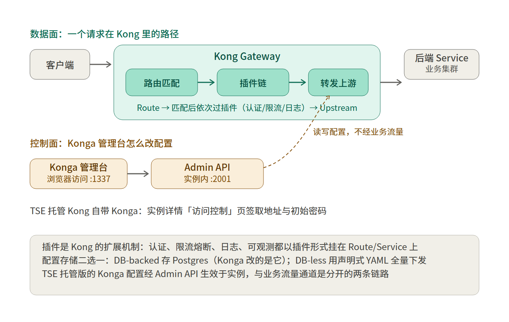

# 腾讯云学习笔记：云原生网关 Kong 与 Konga

## 1. 概述

Kong 是开源的微服务 API 网关，部署在业务服务前面，统一负责请求转发、认证、限流、熔断、日志等入口治理。腾讯云把 Kong 做成了托管产品「云原生网关」，隶属微服务引擎 TSE / 云原生智能网关产品线，底层资源、高可用、弹性扩缩容均由腾讯云托管，配置在腾讯云控制台或 Konga 管理台完成。云原生网关可作为云上微服务架构的流量入口，直接从注册中心或容器服务 TKE 关联后端服务，实现动态代理。Konga 是 Kong 的开源 Web 管理台，腾讯云的 Kong 网关实例自带 Konga，用于管理 Kong 原生对象（Services / Routes / Consumers / Plugins / Upstreams 等）。

## 2. 核心概念

| 概念          | 含义                                                                                                                                        |
| ----------- | ----------------------------------------------------------------------------------------------------------------------------------------- |
| Service     | Kong 所管理的上游 API/微服务的抽象对象，核心属性是 URL（或 protocol / host / port / path）；TSE 控制台「服务路由 > 服务」中以 K8S 服务类型创建，绑定 TKE 服务来源后按命名空间名 + 服务名关联集群内 Service |
| Route       | Kong 的入口，定义请求匹配规则（hosts / paths / methods / headers），每条 Route 必须挂在某个 Service 下，一个 Service 可有多条 Route                                      |
| Consumer    | API 的调用方/使用者，用于控制谁能访问、上报流量；认证类插件以其为配合对象                                                                                                   |
| Plugin      | 挂在 Service 或 Route（也可全局）上的功能模块：认证、限流、熔断、缓存、日志等                                                                                            |
| Upstream    | 虚拟主机名，代表一组负载均衡的后端节点（Target），配 ring-balancer（环形均衡器）；Konga 的 UPSTREAMS 页面可查看与配置                                                             |
| Target      | Upstream 下的一条后端实例（IP:port + 权重）                                                                                                           |
| Admin API   | Kong 自带的管理 REST API（自建部署默认 :8001），控制台与 Konga 的配置最终都落到它；TSE 托管实例中 Konga 经实例内 Admin API（:2001）改配置                                           |
| 系统插件（tse-）  | 腾讯云在开源 Kong 基础上封装的增强插件，对应控制台能力：tse-breaker（熔断）、tse-rate-limiting（限流）、tse-prometheus、tse-trace、tse-cloud-waf、tse-traffic-mirror 等          |
| 原生插件        | 开源 Kong 自带插件，在 Konga 插件市场配置：acl、basic-auth、hmac-auth、key-auth、proxy-cache、acme 等                                                          |
| Higress（易混） | 阿里开源的云原生网关（阿里云云原生网关用的才是它），与腾讯云 TSE 云原生网关无关；TSE 创建实例的 API 参数 type 官方明确"目前只支持 kong"，选型对比时可把它与 Kong / APISIX 并列了解，但腾讯云没有 Higress 托管版         |

## 3. 关键机制/架构

### 3.1 一条请求的完整链路（Kong 官方口径）

1. 客户端请求打到 Kong 的代理端口（自建默认 8000 / 8443）。
2. Kong 用请求去匹配已配置的 Route 规则。
3. 匹配成功 → 执行该 Route / Service 上配置的 Plugin 链（如先认证、再限流）。
4. 按该 Route 对应 Service 的配置代理到上游（或 Upstream → Target 做负载均衡）。
5. 没有任何 Route 匹配 → 返回 404：`"no route and no Service found with those values"`。

### 3.2 路由匹配规则（官方文档明确）

- HTTP 路由可用字段：methods、hosts、headers、paths（https 加 snis）；TCP 用 sources/destinations，gRPC 用 hosts/headers/paths。
- 所有字段都是可选，但**至少要配一个**。
- 匹配条件：请求必须满足 Route 配置的**所有**字段，且每个字段命中**至少一个**配置值。  
  例：Route 配 `hosts:[example.com], paths:[/foo], methods:[GET]`，则 `GET /foo`（Host: example.com）命中；`POST /foo` 或 `GET /` 都不命中。

### 3.3 负载均衡（ring-balancer）

- Kong 支持两种方式：DNS 式和 ring-balancer；ring-balancer 需要配 Upstream + Target，增删后端由 Kong 自己处理，不需要更新 DNS。
- 会话保持：在 Upstream 的 HASH ON 选 IP，按客户端 IP 哈希，多副本 Pod 场景让同一客户端落到同一 Pod。
- TKE 服务来源模式下，云原生网关自动拉取 TKE Service 关联的 Pod IP，Pod IP 变化时动态更新 Upstream——这是"服务来源"模式比手填 IP 更适合 K8s 的原因：发版替换镜像后，网关侧无需改配置。

### 3.4 TSE 托管架构里"两套管理面"的关系

- **腾讯云控制台**（TSE 控制台 > 云原生网关）：管实例生命周期（新建/扩缩容/监控/日志）、服务来源、服务与路由、tse- 系统插件、IP 黑白名单、证书域名。系统插件本质是控制台能力的封装（如 tse-rate-limiting 对应控制台限流策略）。
- **Konga**：实例自带的开源管理台`，直接操作 Kong 原生对象（Services / Routes / Consumers / Plugins / Upstreams / Certificates）。登录方式：实例详情「访问控制」页签 → Konga 公网或内网访问地址（端口 :1337）+ 管理员账号 admin + 初始密码（首次登录后尽快改密）。`
- `两边都能配 Service/Route/Plugin；tse- 系统插件`对应的控制台能力在 Konga 里没有对应界面，原生插件则要在 Konga 里配。

### 3.5 TSE 托管带来的平台能力（概述页明确）

- 免运维：底层资源由腾讯云托管；不停服扩缩容（规格 + 副本数）。
- 高可用：集成 CLB 探活与负载均衡，节点故障自动切流；同城双可用区部署（标准版/专业版）。
- 可观测：CPU/内存/带宽监控；插件可把数据输出到 Prometheus / 腾讯云监控；日志与 CLS 集成。
- 系统参数：控制台批量改请求体大小、TLS 版本等，不停服。

## 4. 关键操作/配置

### 4.1 控制台主链路（访问 TKE 服务五步）

1. **创建网关**：TSE/微服务平台控制台 → 云原生网关 → 实例列表 → 新建。
2. **关联服务来源**：进入实例 → 服务路由 > 服务来源 → 新建，类型选**容器服务**，选与网关**同 VPC** 的 TKE 实例。
3. **添加服务**：服务路由 > 服务 → 新建，服务类型选 K8S 服务，来源选上一步的服务来源，填**命名空间名 + 服务名**。
4. **配路由**：点服务名进路由页 → 新建，请求方法/请求路径/Host 至少配一种；同服务多条路由时可用"路由优先级检测"确认匹配顺序。
5. **调用验证**：基本信息页拿负载均衡地址，`curl http://<网关LB IP>/<路由路径>`。

### 4.2 新建网关的关键参数

| 参数     | 要点                                                                                              |
| ------ | ----------------------------------------------------------------------------------------------- |
| 产品版本   | 开发版 / 标准版 / 专业版；专业版有弹性伸缩、可用区指定等高级特性，可用于测试、生产                                                    |
| 网关版本   | 自定义配置时可指定（文档列 2.8.1、2.5.4、2.5.2 等），建议最新稳定版                                                      |
| 节点数量   | 2 节点只支持随机可用区；≥3 才支持指定 2~3 个可用区                                                                  |
| 部署架构   | 开发版=同城单可用区；标准版/专业版=同城双可用区                                                                       |
| 节点网络   | 与业务同 VPC（服务来源绑定 TKE 的前提）                                                                        |
| 公网负载均衡 | 可选，开启产生费用，1-2048Mbps，支持主备可用区                                                                    |
| 日志     | 实时日志服务免费；持久化需开 CLS（费用走 CLS）                                                                     |
| 前置角色   | 账号需有 ApiGateWay_QCSRole 角色及 `QcloudAccessForApiGateWayRoleInCloudNativeAPIGateway` 策略，创建弹窗里授权即可 |

### 4.3 Konga 主链路

1. **登录**：实例详情 → 基本信息页上方「访问控制」页签 → 取 Konga 公网/内网地址（:1337）+ admin + 初始密码。
2. **建服务**：左侧 SERVICES → ADD NEW SERVICE。
3. **建路由**：服务详情里配 Route。
4. **配插件**：进 Route（或 Service）详情 → ADD PLUGIN → 插件市场按分组选（Authentication / Security / Traffic Control…）。
5. **建 Consumer 及凭证**：CONSUMERS 页面建用户，再为其建认证凭证（如 HMAC 的密钥、basic-auth 的账密）。

### 4.4 插件配置示例（文档明确的三个）

- **ACL 访问控制**：先给 Consumer 分组（Consumer 详情 → Groups tab → 加 group 如 access-group）→ Route 上 ADD PLUGIN 选 Acl → `allow` 填允许的 Group（allow/deny 至少一项；consumer 留空表示对所有 Consumer 生效）。效果：组内请求 200，组外 403 `"You cannot consume this service"`。**前提：该 Route 已启用某种认证插件。**
- **Proxy Cache**：Route 上 ADD PLUGIN 选 Proxy Cache → response code（建议 200）、request method（GET）、content type（**必须与后端响应头完全匹配**，`application/json` 和 `application/json; charset=utf-8` 算两个值）、cache ttl。验证看响应头 `X-Cache-Status: Miss → Hit`。
- **熔断（系统插件 tse-breaker，控制台侧）**：支持响应时间模式（超阈值=一次错误）和错误码模式（默认 503，支持 500-599）；错误率或连续错误数达标触发熔断；熔断后按指数递增半开探测（2s 起步，连续正常请求次数达标即恢复）；可自定义熔断返回状态码/响应体/响应头。

## 5. 常见坑与限制

1. **腾讯云文档产品 ID 正在迁移**：同一篇文档存在 1364 → 1826（以及 436、649 等旧 ID）多个入口，搜索结果 URL 可能互相重定向；引用文档时认准 1826（云原生智能网关）为新目录。
2. **Route 至少要有一个匹配字段**，且多字段是"与"关系——配了 paths 又配了 methods，POST 请求就 404，这不是服务挂了。
3. **TSE 新购限制**：目前云原生网关仅对 Polaris 微服务场景白名单开放新购，其他场景新购会重定向到 Polaris 控制台；已有实例不受影响。
4. **ACL 插件必须先有认证插件**：没有认证就没有 Consumer 身份，ACL 白名单无从生效。
5. **Proxy Cache 的 content-type 要全串匹配**，charset 差一个都算不命中缓存。
6. **Konga 初始密码只展示一次**，登录后尽快改。
7. **公网访问 Konga 有白名单配置**，白名单为 0.0.0.0 时等于公网裸奔，改配置前先确认白名单范围。
8. **网关与服务来源必须同 VPC**，绑定 TKE 服务来源前先核对。
9. **用响应头判断流量路径**：`Via: kong/x.x`、`X-Kong-Proxy-Latency`、`X-Kong-Upstream-Latency` 可证明请求确实经过了 Kong；`X-Cache-Status` 说明该 Route 挂了缓存插件；403 多为认证/ACL 插件拦截，而非后端故障。

## 6. 参考文档

- 云原生网关概述：<https://cloud.tencent.com/document/product/1826/134750>
- 新建网关：<https://cloud.tencent.com/document/product/1826/134765>
- 使用云原生网关访问 TKE 服务：<https://cloud.tencent.com/document/product/1826/134753>
- 插件管理（系统/原生插件全表）：<https://cloud.tencent.com/document/product/649/119255>
- 使用 HMAC Auth 认证访问：<https://cloud.tencent.com/document/product/436/73677>
- 使用 ACL 访问控制：<https://cloud.tencent.com/document/product/649/119267>
- 熔断插件（tse-breaker）：<https://intl.cloud.tencent.com/zh/document/product/1290/79454>
- Kong 官方 Key Concepts：<https://docs.konghq.com/enterprise/2.2.x/introduction/key-concepts>
- Kong 官方 Getting Started：<https://docs.konghq.com/gateway/2.6.x/get-started/comprehensive>
