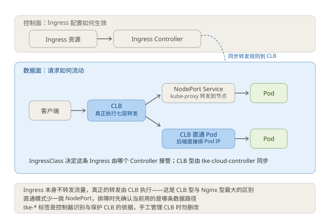
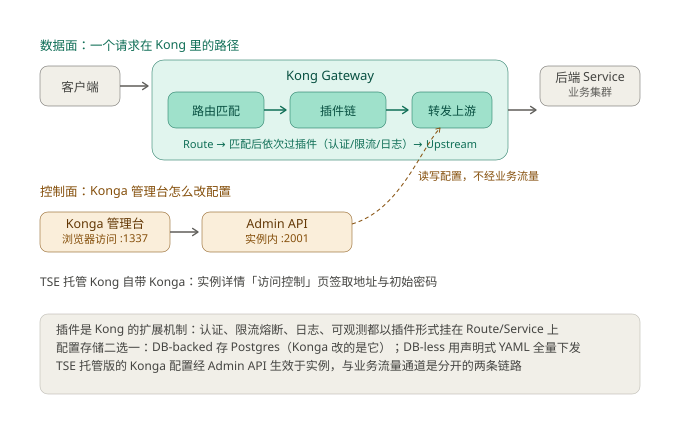

# 腾讯云实战排查手册（六大模块全量版）

## 1. TKE Ingress（Nginx / CLB）

### 1.1 链路全景（先建立心智）



```
用户请求
  ↓ ① Ingress 资源（只是一份配置说明，不转发流量）
Ingress Controller (Nginx Pod / CLB)
  ↓ ② Service (ClusterIP)
Endpoints  ← 90% 故障都在这
  ↓ ③ Pod
```

**铁律**：
- Ingress 本身**不转发流量**，是 Controller（Nginx/CLB）在干活。
- `Endpoints` 空 = Service 选不到 Pod = 必然 502/无响应。

### 1.2 两种形态对比

| 维度 | Nginx Ingress（默认） | CLB Ingress |
|---|---|---|
| 控制器 | 集群内 Nginx Pod | 腾讯云 CLB 七层 |
| 能力 | Annotation 极度丰富 | 控制台为主 |
| 灰度 | ✅ canary | ❌ 弱 |
| 会话保持 | ✅ cookie affinity | ✅ 控制台 |
| 限流 | ✅ limit-rps | ❌ 弱 |
| 适用 | 主流、要细粒度控制 | 简单、不想运维 Nginx |

> **注意**：Nginx Ingress 已停更——开源 ingress-nginx 项目 2025 年 11 月宣布退役，TKE 的 NginxIngress 扩展组件也已停止更新。存量可继续用，新建入口建议优先 CLB 型 Ingress / 云原生网关 / Gateway API。

### 1.3 核心 Annotation 速查表（背夹）

#### 路径 / 重写（404 高发区）
| Annotation | 值示例 | 作用 | 易踩坑 |
|---|---|---|---|
| `rewrite-target` | `/$2` | 重写目标路径 | 带 `(.*)` 必须用捕获组 `$N` |
| `use-regex` | `"true"` | 启用正则匹配 | 与 rewrite 一起用时易吞路径 |
| `path` | `/api(/|$)(.*)` | 路由路径 | 格式决定能否匹配 |
| `app-root` | `/` | 应用根 | 少用 |

#### 灰度发布
| Annotation | 值 | 作用 |
|---|---|---|
| `canary` | `"true"` | 开启金丝雀 |
| `canary-by-header` | `x-canary` | 按 Header 分流 |
| `canary-by-header-value` | `yes` | Header 命中值 |
| `canary-weight` | `"10"` | 按权重分流 10% |

#### 限流 / 超时 / 体量
| Annotation | 值 | 作用 | 故障表现 |
|---|---|---|---|
| `limit-rps` | `"20"` | 每IP每秒请求数 | 429 |
| `limit-connections` | `"50"` | 每IP最大连接 | 429 |
| `proxy-body-size` | `"100m"` | 请求体上限 | 413 (上传失败) |
| `proxy-read-timeout` | `"300"` | 后端响应超时 | 504 |
| `proxy-connect-timeout` | `"10"` | 连接后端超时 | 502/504 |
| `proxy-send-timeout` | `"300"` | 发送超时 | 504 |

#### 安全 / 会话
| Annotation | 值 | 作用 |
|---|---|---|
| `whitelist-source-range` | CIDR列表 | IP白名单 |
| `force-ssl-redirect` | `"true"` | HTTP强制跳HTTPS |
| `affinity` | `cookie` | 会话保持 |
| `session-cookie-name` | `route` | 会话Cookie名 |
| `proxy-set-headers` | `configmap名` | 自定义请求头 |

### 1.4 排查标准动作（一套打天下）

```bash
# 1. Ingress 是否被接受
kubectl describe ingress <name>

# 2. Endpoints 是否为空 —— 90%故障在这（看销售看这里）
kubectl get endpoints <svc-name>
kubectl get svc <name> -o yaml | grep -A5 selector

# 3. Controller 状态与日志
kubectl get pods -n ingress-nginx
kubectl logs -f <nginx-controller-pod> -n ingress-nginx

# 4. 绕过 Ingress 直接测后端，隔离问题
kubectl port-forward <pod> 8080:80
```

### 1.5 高频故障对照表

| 症状 | 主因 | 定位 | 解法（含回滚） |
|---|---|---|---|
| 502 | Pod 挂了 / Service 选不中 | endpoints 空、pod 非 Running | 修 selector / 重启 deployment |
| 504 | 后端慢超 proxy-read-timeout | 看后端日志、加超时 | 调大 read-timeout；后端优化 |
| 413 | 上传超 body 限制 | 413 代码 | 调 proxy-body-size |
| 404 | 路径重写吞了路径 | rewrite-target 写死 `/` | 用 `/$N` 捕获组 |
| CORS 报错 | 缺响应头 | F12 看响应头 | 加自定义头或后端处理 |

**风险等级说明**：
- 改 annotation 属**低风险可回滚**（改回旧值即回滚，实时生效）。
- 改 selector 属**中风险**，改错瞬间断流，建议先备份原 yaml。

### 1.6 完整可用 YAML（直接改命名空间/域名用）

```yaml
apiVersion: networking.k8s.io/v1
kind: Ingress
metadata:
  name: myapp-ingress
  namespace: production
  annotations:
    nginx.ingress.kubernetes.io/rewrite-target: /$2
    nginx.ingress.kubernetes.io/proxy-body-size: "50m"
    nginx.ingress.kubernetes.io/proxy-read-timeout: "120"
    nginx.ingress.kubernetes.io/affinity: "cookie"
spec:
  ingressClassName: nginx
  tls:
    - hosts: [api.myapp.com]
      secretName: myapp-tls
  rules:
    - host: api.myapp.com
      http:
        paths:
          - path: /api(/|$)(.*)
            pathType: ImplementationSpecific
            backend:
              service:
                name: myapp-svc
                port: { number: 80 }
```

---

## 2. 云原生网关 TSE

### 2.1 定位与本质（先建立正确认知）



**一句话本质**：腾讯云 TSE（微服务引擎）旗下的**云原生网关**，是 **Kong 网关的托管版**（2026-09 对照官方文档与控制台核实；此前"托管版 Higress / Istio / Envoy"的说法有误，已修正）。实例自带 Konga 管理台：地址与初始密码在实例详情「访问控制」页签（:1337），配置经实例内 Admin API（:2001）生效，与业务流量是两条链路。

这决定了三件关键事：
1. **规则热下发**：路由、限流、熔断都在控制台 / Konga 里配，热更新，不改 Pod、不重启。
2. **多注册中心原生接入**：这是它和 Nginx Ingress 最本质的差异——Nginx 只会转发到 K8s Service，而它的服务来源直接对接 **K8s / Nacos / Consul / DNS 静态**，可以做到"一个网关统一接微服务和传统服务"。
3. **两条对接 TKE 的路线**：服务来源模式（网关 watch 集群 Service）与 KIC 模式（Controller 跑在集群内），细节见《腾讯云学习笔记-TKE-Ingress与Kong网关》。

> 控制台路径：腾讯云控制台 → **微服务引擎 TSE** → **云原生网关**

### 2.2 版本与实例规格

- **共享型网关**：多租户共用底层资源，便宜、够用，适合测试/小流量（不推荐生产核心链路）。
- **独享型网关**：独占无状态工作负载实例，支持**横向扩缩容主/副本数**，生产标配。
- 计费按：**网关规格（连接数/QPS 上限）× 时长 + 超出部分**。

排查准备金口诀：**先看是共享还是独享 → 看规格有没有被打满 → 再看规则有没有生效**。

### 2.3 能力对照表（务必吃透这张）

| 能力 | Nginx Ingress | TSE 云原生网关 | 实战意义 |
|---|---|---|---|
| 限流维度 | 注解(rps/conn) | QPS、并发连接、请求速率、IP 维度，插件化 | 可做更细颗粒度 |
| 限流实现 | 单 Pod 本地限流 | **分布式限流（Redis 中心化）** | 多副本下不重复计数 |
| 熔断降级 | 几乎无 | 失败率/延迟阈值 + **半开探测** | 生产救命的差异化 |
| 灰度 | canary 注解 | 金丝雀、灰度泳道、百分比、Header 多重 | 更贴合微服务体系 |
| 服务发现 | K8s Service | K8s/Nacos/Consul/**DNS静态** 多源 | 统一入口的关键 |
| 鉴权认证 | 基本无 | JWT/API Key/**CAM**/自定义插件 | 网关层统一鉴权 |
| 可观测 | 日志 | 指标+日志+**追踪**，与云监控/CLS打通 | 查链路更强 |
| 插件扩展 | 注解受限 | Kong 插件体系（认证/限流/日志/可观测，支持自定义插件） | 网关层能力可插拔 |

### 2.4 核心概念详解（每个都要能讲、能排查）

#### 2.4.1 路由规则（Route）
- **匹配维度**：域名（Host）> 路径（Path 前缀/精确/正则）> Header > Cookie。
- **优先级**：同域名下**规则按配置顺序或显式优先级**匹配，先匹配先生效。优先级冲突是"流量跑错后端"的第一大原因。
- 典型坑：`/api` 前缀规则和 `/api/admin` 精确规则并存时，若 `/api` 优先级更高会把 `/api/admin` 也吃掉。
- 排查法：控制台看该请求命中了哪条规则（点开规则看"最近匹配/未命中日志"）；CLS 搜网关访问日志的 route 命中字段。

#### 2.4.2 限流（Rate Limit）
- 三个粒度：**全局限流**（整条路由）、**IP 限流**、**用户/Header 限流**。
- 两类实现（对应 Kong rate-limiting 插件的策略）：
  - 本地限流（local）：单实例计数，便宜但多副本不准；
  - **分布式限流（redis / cluster）**：计数中心化，**多副本下必须用**，否则流量翻倍每副本各自放行。
- 常见误伤：配了"默认全局限流插件"作用于所有路由，新加的服务被误限。排查：看是否命中默认插件，检查插件作用的 service/route 范围。

#### 2.4.3 熔断降级（Circuit Breaker）
状态机：**关闭 → 熔断（OPEN）→ 半开（HALF_OPEN）→ 关闭**。
- 触发指标：连续错误数、错误率、平均 RT、慢调用数。
- **半开探测**：熔断后放少量请求探测，成功达到阈值才恢复，失败则回到熔断。
- 与限流区别：限流是"主动挡"，熔断是"被动保护"下游不被打垮。
- 排查：熔断后流量进半开导致少量 5xx 属正常；看熔断指标的阈值设置是否过敏感。

#### 2.4.4 鉴权认证
- **JWT**：无状态，网关校验签名+过期，适合接口对外。
- **API Key / 自定义 Header**：简单但对内。
- **CAM**：腾讯云统一权限，跨服务互相调用时用。
- 常见问题：JWT 密钥配置错了 → 401；白名单路径未配置 → 登录接口也被拦截。

#### 2.4.5 服务发现
- 支持 **K8s Service、Nacos、Consul、DNS 静态服务**。
- 关键配置：命名空间/分组名必须与注册中心一致，否则解析不到 → 网关 502。
- 排查 502 顺序：**注册中心有没有这个服务 → 命名空间/分组对不对 → 网关侧服务来源有没有填对 → 端口是否正确**。

### 2.5 生产级配置样例（控制台参数 / 启发）

> 控制台创建路由：网关 → 路由管理 → 创建路由

- **Host**：`api.myapp.com`
- **Path 前缀**：`/v1/order`
- **匹配优先级**：`100`（数值越大优先级越高，需按业务设）
- **后端服务来源**：`Nacos` → 服务名 `order-svc` → 端口 `8080`
- **负载均衡策略**：加权轮询 / 最少连接
- **限流插件**：分布式限流，QPS=1000，超限返回 429
- **熔断策略**：错误率 30% 持续 10s 熔断 30s，半开放 5% 流量

### 2.6 典型故障排查（约 7 个，逐个可落地）

#### 故障 1：请求 502 Bad Gateway
排查链：
1. 后端服务在注册中心是否**在线**？（Nacos 控制台看服务列表/健康实例数）
2. 命名空间/分组是否和注册时一致？
3. 服务端口、协议是否填对？
4. 后端服务自身是否 502（绕开网关直接 curl 后端 IP:port）？
5. 是否因为服务下线、版本变更导致实例数为 0？

#### 故障 2：请求 404，路由没匹配上
1. 检查**域名（Host）**是否完全一致（含 `www`、大小写、端口）；
2. 检查 **Path 前缀/正则**是否正确，是否被更精确但低优先级的规则覆盖；
3. 查看网关**访问日志**里该请求命中 route 的 ID，比对预期。

#### 故障 3：限流误伤 / 被限流
1. 确认是全局插件还是路由级插件；
2. 确认限流阈值与后端真实容量是否匹配；
3. 查看是否被**默认全局限流插件**命中（插件作用范围含新服务时最易踩）；
4. 若为分布式限流，检查 Redis 连通性与性能。

#### 故障 4：灰度没生效（流量没分流）
1. 确认灰度规则（Header/权重/泳道）是否与**主线规则**在同一域名下且优先级正确；
2. 确认请求是否真的携带了灰度 Header / Cookie；
3. 确认是灰度后端版本是否已注册且健康。

#### 故障 5：鉴权失败 401
1. JWT：校验 Secret 与算法（HS256/RS256）是否一致；
2. 域名级 vs 路由级鉴权作用范围
3. 是否漏配"放行白名单路径"（如 /healthz、登录接口）。

#### 故障 6：跨域（CORS）报错
- 网关侧配置跨域插件：允许 Origin、Methods、Headers；
- 检查后端是否也加了跨域头，造成重复/冲突。

#### 故障 7：性能打满 / 扩容
- 独享网关才支持扩缩容；共享网关无法扩容，超限直接限流/丢包。
- 排查是否打入流量超过规格：看监控的 QPS/新建连接/并发达到上限。

### 2.7 排查命令 / 平台动作速查

| 症状 | 控制台/动作 |
|---|---|
| 502 | Nacos 服务列表看健康实例；CLS 网关日志搜 502 |
| 404 | 路由管理核对 Host/Path/优先级；看请求命中记录 |
| 被限流 | 网关监控看限流次数；核对插件作用范围 |
| 灰度不生效 | 校验 Header/权重 + 新旧版本注册健康 |
| 鉴权 401 | 检查 JWT Secret、白名单路径 |
| 性能 | 独享实例扩副本；共享实例替换升级 |

> 关键监控入口：网关实例 → 监控；网关日志 → 对接 CLS（与模块四联动查）。

---

## 3. TDSQL-C MySQL 版

### 3.1 架构认知（决定你排查思路的前提）

TDSQL-C = 腾讯云的 **CynosDB**，核心是**存算分离**：
- **计算层（数据库实例）**：跑 MySQL 进程、内存缓存，不落全量数据
- **存储层（分布式存储集群）**：三副本，跨可用区冗余，自动故障切换
- **"日志即数据"**：写操作先写存储层日志，计算节点可秒级拉起

由架构推出的四条**实战结论**：
1. 实例故障重开极快（秒级）——因为本地几乎没有"要恢复的数据"
2. 扩存储**不用迁移数据**——存储自动扩容（可达数 TB）
3. 读 QPS 不够，靠**加只读计算节点**解决，不是加盘
4. 性能瓶颈**几乎不在磁盘 IO**，多在 CPU、连接数、锁、慢 SQL

两种模式：
- **预置模式（Dedicated/Pro）**：独占算力，稳定
- **Serverless 模式**：按实际用到的算力计费，低谷自动缩到最小规格；适合波动大/测试

### 3.2 核心概念表（每个都要能翻译成"故障时怎么用"）
| 概念 | 含义 | 排查意义 |
|---|---|---|
| 参数模板（参数组） | 一组 show variables 的集合，可批套/回滚 | 调优入口；修改先看影响面 |
| 慢查询日志 | 超阈值 SQL 集合 | 性能定位第一入口 |
| 审计日志/通用日志 | 全量操作记录 | 安全合规、追溯 |
| 只读实例+只读地址 | 类似 slave，承担读流量 | 读写分离架构 |
| 连接数/连接串 | 客户端怎么连、并发多少 | "too many connections"源头 |
| binlog | 逻辑日志，复制/回档基础 | 主从延迟、复制中断排查 |
| 备份+回档 | 全量+增量，按时间点恢复 | 最高风险操作 |

### 3.3 高频参数（先背这批，覆盖 90% 场景）
```
# —— 连接相关（"too many connections"场景）——
max_connections                # 最大连接数；别盲目调大，会挤爆内存
wait_timeout / interactive_timeout  # 空闲连接回收秒数；太大占连接，太小频繁重建
# 提示：TDSQL-C 自带读写代理/连接池，排查时先确认连的是代理还是直连

# —— 缓存命中率 ——
innodb_buffer_pool_size        # 总缓存；命中率低→IO多→明显变慢
# 注意：MySQL 8.0 已移除 query_cache，别在 8.0 上配这个

# —— 提交策略：性能 vs 安全的经典取舍 ——
innodb_flush_log_at_trx_commit  # 1=每次提交刷盘(最安全) 0=性能最好但可能丢1秒日志 2=写OS缓存
sync_binlog                     # 1=每条binlog sync(安全) 0=性能好
# ⚠️ 生产建议：两参数要么都取 1（安全），要么配成 (0或2, 0)，别折中而不自知丢数据风险

# —— 慢查询定位 ——
slow_query_log                 # 必须开
long_query_time                # 阈值秒数，生产建议 ~1s
log_queries_not_using_indexes  # 记录没走索引的查询——排查缺索引的神器

# —— 其他高频 ——
innodb_lock_wait_timeout       # 锁等待超时秒数，默认50；死锁/锁竞争时调整
max_allowed_packet             # 单次包上限；大字段/大事务报错看这里
```

### 3.4 性能排查标准流程

#### 3.4.1 慢查询排查链路（必须形成肌肉记忆）
```
1. 开慢日志 → 导出最近慢 SQL
2. 对目标 SQL 执行:
   EXPLAIN SELECT ...;
3. 看四个字段：
   - type    : ALL=全表(危险) / range=范围 / ref=等值 / const=常量
   - key     : 实际用的索引；NULL=没走索引
   - key_len : 用到索引的前缀长度
   - rows    : 预估扫描行数，对比表总行数
4. 判断：
   - 全表扫描      → 建索引（复合索引注意最左前缀）
   - 走了索引但rows大 → 索引区分度低 / SQL 需改写
   - 有索引却不走   → 检查隐式类型转换、函数包裹索引列
5. 验证：改后再 EXPLAIN + 实测耗时对比
```

#### 3.4.2 连接数打满排查（先分析原因，再决定调参）
| 可能原因 | 判断特征 | 处理 |
|---|---|---|
| 慢 SQL 占连接 | 慢日志集中、CPU 高 | 优化 SQL、杀会话 |
| 连接泄漏 | 客户端不释放，池上限不足 | 查应用连接池配置 |
| 死锁/锁等待 | 报 Lock wait timeout | 看 SHOW ENGINE INNODB STATUS |
| 突发流量 | QPS 突增 | 加只读/扩容，临时调大 |

### 3.5 只读延迟排查（读到旧数据时）
```
现象：走只读地址读到旧数据，或复制状态异常
排查：
1. 看复制状态与延迟秒数（Seconds_Behind_Master）
2. 看控制台"主从延迟"监控趋势
3. 常见根因：
   - 只读节点规格 < 主库规格   → 升级只读规格
   - 只读上有长事务/大查询     → 拆解/优化
   - binlog 同步 IO 瓶颈       → 查网络与存储
   - 主库大事务未同步完        → 拆小事务
```

### 3.6 操作安全（风险分级，缺一不可）
| 操作 | 风险 | 必须动作 |
|---|---|---|
| 调参数 | 低 | 记录原值，可随时改回；Serverless 注意规格下限 |
| 加索引/在线 DDL | 中 | 用在线 DDL（腾讯云默认 INPLACE），低峰执行 |
| 删数据/回档 | **高** | 先全量备份当前库；回档到**新实例**核对后再切换，别直接覆盖线上 |
| 主备切换 | **高** | 低峰执行，确认只读延迟低于阈值，先准备回切预案 |

### 3.7 TDSQL-C 特有排查姿势（与自建 MySQL 的差异点）
- **分清主地址/只读地址**：只读地址默认只读，写会报错
- **读写代理 vs 直连**：先判断报错来自代理层还是实例层
- **存储三副本**：单副本异常会像"偶发读失败"，优先看控制台存储健康度，别闷头调 SQL

---

## 4. 日志服务 CLS

### 4.1 全链路四层（先建立心智）
```
采集(Agent/CRI/云产品) → 加工(解析/脱敏/投递) → 检索&分析(索引) → 告警&投递归档
```
对照你在 TKE/服务器上看到的故障现象，永远先判断"断在哪一层"。

### 4.2 第一件事：日志是怎么进 CLS 的（决定排查方向）
- **容器日志**：通过 **CLS 的日志采集（Pod 里跑 LogListener/CRI 采集）** 或 **TKE 与 CLS 的联动采集**，支持采集容器**标准输出 stdout + 容器内文件**
- **主机日志**：服务器装 **LogListener** 客户端
- **云产品日志**：CLB/Nginx/TDSQL-C/网关等**一键开关**推送

> 排查看法：日志没上来，先分清是"采集端没采到"还是"采到但解析/投递失败"。

### 4.3 采集配置必须避开的 6 个坑
1. **路径配置**：容器日志用相对/绝对路径写错 → 采不到；标准输出要开 `stdout` 采集
2. **解析格式不匹配**：日志是 JSON 你配了正则会解析失败 → 搜不到字段，只有原始行
3. **索引没配**：字段没建索引 → `检索`能搜原始日志，但**不能按字段过滤/聚合**，SQL 分析报错
4. **单行/多行**：多行日志（堆栈 traceback）没开多行模式 → 被拆成多行，检索错乱
5. **日志组/主题隔离**：不同业务共用一个 topic → 权限混乱+检索互相污染
6. **采集端资源**：LogListener 掉了 / CPU 打满 / 网络不通 CLS → 静默丢日志

### 4.4 索引：全文 vs 键值（最影响"能不能查"和"多少钱"）
| 类型 | 适用 | 代价 |
|---|---|---|
| 全文索引 | 快速关键词搜，不强求字段 | 成本高、不能按字段聚合 |
| 键值索引（KV） | 按字段过滤/分组/聚合 | 更精准、成本可控 |
| 开启字段索引 | SQL 分析（SUM/COUNT/GROUP）必需 | 按字段计费 |

**排查口诀**：`检索`查不到，先看索引；`分析`报错，先看键值索引有没有开。

### 4.5 CLS SQL 分析快速上手（常用 5 句）
```sql
-- 按状态码分布
SELECT status, COUNT(*) AS c FROM 日志表 GROUP BY status ORDER BY c DESC
-- 某接口 P95 耗时
SELECT approx_percentile(耗时字段, 0.95) AS p95 FROM 日志表 WHERE path='/api/order'
-- 最近 5 分钟 5xx 次数
SELECT COUNT(*) FROM 日志表 WHERE status>=500 AND __TIMESTAMP__ > (NOW() - INTERVAL 5 MINUTE)
-- 去重用户数
SELECT COUNT(DISTINCT user_id) FROM 日志表
```

### 4.6 告警配置（比想象中容易漏的 3 处）
1. **告警语句要跟索引匹配**：SQL/检索筛选的条件字段，必须已建索引，否则告警静默不触发
2. **周期+窗口**：配置"每分钟执行、统计过去 1 分钟"，别只盯阈值漏了统计口径
3. **通知渠道**：短信/企微/TWebhook/回调——务必配**恢复通知**，否则没人知道它恢复了

### 4.7 常见故障排查对照表
| 症状 | 最可能原因 | 动作 |
|---|---|---|
| 日志完全没有 | 采集 Agent 挂了/路径错/权限 | 查 LogListener 状态、路径、容器选择器 |
| 只有原始日志搜不到字段 | 解析格式不匹配 | 改解析规则（JSON/正则） |
| 能搜不能按字段聚合 | 键值索引没开 | 开启字段索引 |
| 某些日志丢失/延迟 | 采集端压力/网络 | 看采集端监控、日志错误上报 |
| 告警一直不触发 | 索引未覆盖/统计口径错 | 用检索先手动跑一遍告警语句 |
| 费用暴涨 | 索引开太宽/采集了无关日志 | 缩小索引字段、控制采集范围 |

### 4.8 投递到 COS（长期归档）要点
- 通过**日志加工/投递任务**把热日志定期转投到 COS，降低 CLS 热存储成本
- 归档后注意：COS 侧要配生命周期策略，否则体积无限增长

---

## 5. 云监控（可观测平台）

### 5.1 三层监控思维（排障时的"视角"）
| 层 | 看什么 | 典型问题 |
|---|---|---|
| 集群/容器层 | 节点 CPU/内存/磁盘、Pod 重启、调度失败 | 资源不足、OOM、被驱逐 |
| 云产品层 | CLB 流量/健康检查、DB 连接/慢查询、网关 QPS/错误率 | 组件自身是否异常 |
| 业务层 | 埋点（订单量/转化率）、业务状态码 | 用户是否真受影响 |

> 排障口诀：**先业务层判断"用户有没有受影响"，再逐层下沉**，别一上来死盯 CPU。

### 5.2 指标最容易看错的 3 组概念
- **采集周期 period**：60s / 5min……
- **统计方式 aggregation**：max / avg / sum / count / percentile
- **持续周期 duration**：连续几个周期超阈值才触发

组合举例：
- `period=60s + max + duration=1` → 灵敏（1 分钟 1 次尖峰就报）
- `period=300s + avg + duration=3` → 稳健（15 分钟内均值超才报，防抖动）
- P99/P95 必须用**百分位聚合**，不要用 max，否则被单点毛刺带偏

### 5.3 告警规则完整配置流程（控制台路径）
云监控 → 告警 → 告警策略 → 新建：
1. **选择监控对象**（按标签 / 实例组）
2. **触发条件**：指标 + 阈值 + 周期 + 统计方式 + 持续周期
3. **通知配置**：通知组 / 回调 webhook / 企业微信 / 短信
4. **恢复通知**（务必开，否则没人知道恢复了）
5. **收敛规则**（按维度聚合，避免刷屏风暴）
6. **生效时间 / 屏蔽时间**（变更窗口可临时屏蔽避免误报）

### 5.4 告警设计铁律（少踩 90% 的坑）
1. 区分 **warning / critical** 两档，别全设成同一阈值
2. 必须配**恢复通知**
3. 重要指标设 **SLO/错误预算**（如可用性≥99.9%）
4. 按 namespace/实例聚合成**一条聚合告警**，避免一个故障刷几百条
5. 回调接入值班 IM/工单，短信只在 critical 用
6. 多指标 `and/or` 条件要想清业务语义，避免互相遮蔽

### 5.5 事件告警 vs 指标告警（常被忽略的点）
- **指标告警**：值超阈值（如 CPU 90%）
- **事件告警**：发生了某件事（如 Pod OOMKilled、节点 NotReady、主备切换、安全告警）
> 生产上很多致命问题**只产生事件、不产生指标**，关键事件必须也接入告警通道。

### 5.6 告警风暴处理预案
- 根因：多指标同时越阈 / 误配 / 事件全开
- 第一步：**临时**拉大周期、抬高阈值、限通知群，先止血（不要直接全关，会漏）
- 恢复后：**逐个收敛**配置，只保留有真实信号价值的告警

### 5.7 "告警没收到"排查顺序（自查清单）
① 指标本身有数据吗（无实例/未采集）？→ ② 触发条件写对了吗？→ ③ 通知组里有人吗？→ ④ 渠道通了吗（短信/企微/回调）？→ ⑤ 被聚合/收敛吞了吗？→ ⑥ 事件类告警没单独配？

---

## 6. 全链路排查方法论与发布管理

### 6.1 全链路排查总流程（每次故障都走这套）
> 不管多急，先心里过一遍这四个问题，再动手。这四步是腾讯云运维通用的 SOP 骨架。

```
STEP 0  影响范围   —— 谁受影响？哪个核心链路？评估紧急度（S1/S2/S3）
STEP 1  回滚方案   —— 最坏情况怎么快速回到上一个稳定状态？（先想退路再往前）
STEP 2  操作步骤   —— 沿链路逐层：网关 → CLB → 服务 → 数据库 → 监控日志
STEP 3  验证方法   —— 指标/日志/拨测回验，确认根因与已恢复
风险等级：低 / 中 / 高（每步都要标注）
```

**影响面分级（先定级再动手）**：
- S1（严重）：核心业务全挂 / 支付、登录不可用 → 立即止损，可接受临时降级
- S2（重要）：部分用户受影响，功能降级 → 30 分钟内处理
- S3（一般）：边缘功能 / 运营反馈型问题 → 按正常排期

### 6.2 网络链路排查顺序（腾讯云标准）
```
云原生网关 → CLB → CEN 云联网 → NAT 网关 → 安全组/CFW防火墙 → 目标服务
```
**为什么必须按这个顺序**：越外层越容易是"全灭"型故障，先确认入口健康再下沉，能避免在错误层反复试错。每下沉一层之前，先问："这一层我验证过了吗？"

每一层对应的排查动作：
| 层 | 看什么 |
|---|---|
| 云原生网关 | 路由是否命中、限流是否触发、鉴权是否拦截 |
| CLB | 监听器/转发组/健康检查状态、后端是否剔除 |
| CEN 云联网 | 跨地域路由是否互通、带宽包是否跑满、路由表是否冲突 |
| NAT 网关 | 公网出口是否可达、SNAT 规则、带宽/连接数是否打满 |
| 安全组/CFW | 入/出规则是否遗漏、东西向/南北向策略 |
| 目标服务 | 进程、端口、日志、依赖 |

### 6.3 服务发布管理（发版铁律）
任何一次发版必须完整包含五大件，缺一不可。这是能安全回滚的底线：

```
① 版本号规范  主.次.补丁-构建号（如 1.4.2-20260827），用语义化版本
② 灰度策略    金丝雀(百分比/Header)→分批→(可选)蓝绿
③ 发布步骤    构建→镜像→打标签→灰度→全量→观察期
④ 观测验证    P99延迟、错误率、业务核心指标（阈值拍板）
⑤ 回滚条件    错误率超阈值 / P99超3倍 / 核心指标下降 → 立即回滚
```

**灰度策略怎么选**：
| 策略 | 适用 | 关键点 |
|---|---|---|
| 金丝雀（按权重） | 常规迭代 | 先 5%~10%，观察 10~30 分钟 |
| 金丝雀（按 Header） | 内部验证/渠道测试 | 指定测试流量，不影响真实用户 |
| 分批滚动 | 架构大改/数据库变更 | 逐步放量，每批都有回滚点 |
| 蓝绿 | 高风险/强一致性需求 | 双环境切换，瞬时全量，成本高 |

**回滚前置条件（发版前就要准备好，不是出事才想）**：
- 上一版本镜像/制品**还保留**（不覆盖原生不可回）
- 数据库变更是否可回退（如加了非空列 → 回滚会失败）
- 回滚命令/脚本已固化（人别靠记忆）

### 6.4 变更管理通用 Checklist（发布或任何生产变更）
- [ ] 影响范围：变更会影响谁、什么时段的流量
- [ ] 回滚方案：回滚需要多久、依赖哪些东西
- [ ] 灰度/分批：有没有办法先验证一小部分
- [ ] 观测：变更前后监控看板、对比基线
- [ ] 通知：变更窗口是否通知了相关方
- [ ] 时间窗口：避开业务高峰（若无法避免，则必须有灰度）

### 6.5 复盘脑图（故障处理完必做）
```
根因（5 Why）→ 影响面（实际伤了谁）→ 止损有效性 → 
遗漏点（监控/告警/预案缺口）→ 改进项（做成 action，指定 owner + 截止日）
```

---

## 附：六大模块排查速查卡

| 模块 | 3 秒定位口诀 |
|---|---|
| Ingress | 先看 Endpoints 空不空 |
| 云网关 | 先看路由优先级和限流插件 |
| TDSQL-C | 先看慢查询和连接数 |
| CLS日志 | 先看采集 agent 和索引配置 |
| 云监控 | 先看告警触发条件是否合理 |
| 发布 | 先背回滚命令再谈灰度 |